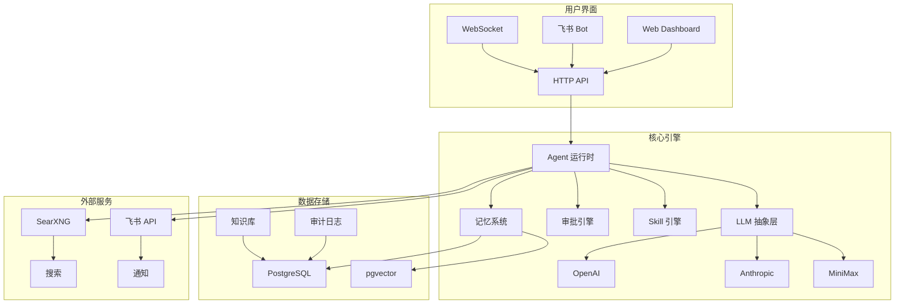

# ColoBot


> 单智能体 + 子智能体协作平台 — 多模态 AI + Skill 编排 + 飞书审批通知

**ColoBot** 是一个开源的 AI 智能体协作平台，支持多模态输入输出、Skill 编排、自动审批流程和飞书集成。它提供了完整的 AI 智能体管理和协作解决方案。

---

## ✨ 特性概览

<div align="center">

| 智能体管理 | Skill 编排 | 审批流程 | 集成支持 |
|-----------|------------|----------|----------|
| 🧠 父子智能体协作 | 📝 Markdown Skill 定义 | ⚖️ 四层审批漏斗 | 📱 飞书交互式卡片 |
| 🔄 上下文压缩 | 🚀 Trigger 引擎 | 📊 规则自进化 | 🔍 SearXNG 搜索 |
| 💾 向量记忆检索 | 🔧 工具白名单 | 📋 审计日志 | 🌐 WebSocket 实时通信 |

</div>

---

## 核心功能

| 模块 | 功能 | 状态 |
|------|------|------|
| **智能体** | 父Agent（全模态：文本/图片/音频/视频） | ✅ |
| | 子智能体（TTL 自动过期，工具白名单） | ✅ |
| | 消息路由 / 会话管理 | ✅ |
| **Trigger + Skill** | Trigger 引擎（cron/interval/webhook/condition） | ✅ |
| | Markdown Skill 定义 + 触发词激活 | ✅ |
| | Skill 自进化（提案→审批→应用） | ✅ |
| **AI 自进化** | Soul 自进化（对话中学习新能力） | ✅ |
| | 用户画像自进化（从对话中学习用户偏好） | ✅ |
| | SOP 流程自进化（用户偏好记忆 + 流程优化） | ✅ |
| **投毒防御** | 信任等级系统 + 内容验证 | ✅ |
| | 自动降级 + 回滚机制 | ✅ |
| **搜索** | SearXNG 多模态搜索 | ✅ |
| **记忆** | 向量语义检索 + 文本混合检索 | ✅ |
| **审批** | 规则自动审批（四层漏斗 + 自进化 + 审计） | ✅ |
| **飞书接入** | 交互式卡片 + 快捷审批按钮 | ✅ |
| **审计** | 操作审计日志 + API 查询 | ✅ |
| **Dashboard** | 飞书配置 / 模型 / Skill / 审批 / 审计 / 安全 | ✅ |
| **Fallback** | 链式 fallback + 跨 provider + 重试 | ✅ |
| **钉钉接入** | 规划中 | 📋 |

---

## 父子 Agent 协作架构

ColoBot 采用**父 Agent + 子 Agent** 协作模式，实现任务分解与隔离执行。

### 架构设计

```
┌─────────────────────────────────────────────────────────────┐
│                      父 Agent (Parent)                       │
│  ┌─────────────┐  ┌─────────────┐  ┌─────────────────────┐  │
│  │ 任务分析    │  │ 任务分解    │  │ 结果审核与汇总      │  │
│  │ LLM 分析    │→ │ 创建子Agent │→ │ 验证子Agent输出     │  │
│  └─────────────┘  └─────────────┘  └─────────────────────┘  │
│                                                              │
│  权限：完整文件系统访问、所有工具、无限 TTL                   │
└─────────────────────────────────────────────────────────────┘
                           │
          ┌────────────────┼────────────────┐
          ↓                ↓                ↓
┌─────────────┐    ┌─────────────┐    ┌─────────────┐
│ 子 Agent 1  │    │ 子 Agent 2  │    │ 子 Agent 3  │
│ ─────────── │    │ ─────────── │    │ ─────────── │
│ TTL: 5min   │    │ TTL: 10min  │    │ TTL: 15min  │
│ 工具: [A,B] │    │ 工具: [C,D] │    │ 工具: [E]   │
│ 沙箱隔离    │    │ 沙箱隔离    │    │ 沙箱隔离    │
└─────────────┘    └─────────────┘    └─────────────┘
```

### 核心特性

| 特性 | 说明 |
|------|------|
| **TTL 自动过期** | 子 Agent 设置生命周期，到期自动销毁，防止资源泄漏 |
| **工具白名单** | 子 Agent 只能使用父 Agent 授权的工具，限制危险操作 |
| **沙箱隔离** | 子 Agent 文件访问限制在指定目录，防止越权 |
| **并发限制** | 控制同时运行的子 Agent 数量，避免资源耗尽 |
| **结果审核** | 父 Agent 验证子 Agent 输出，过滤幻觉和错误 |

### 使用示例

```typescript
import { SubAgentManager } from '@colobot/core';

// 父 Agent 创建子 Agent
const manager = new SubAgentManager({
  maxConcurrent: 3,        // 最大并发数
  defaultTTL: 60000,       // 默认 TTL 60秒
});

// 创建专用子 Agent
const subAgent = await manager.spawn({
  name: 'research-agent',
  soul: '你是一个文献调研助手...',
  tools: ['web_search', 'read_file'],  // 工具白名单
  ttl: 300000,                        // 5分钟过期
});

// 分配任务
const result = await manager.delegate(subAgent.id, '搜索量子隧穿相关论文');

// 父 Agent 审核结果
if (result.success) {
  console.log('子 Agent 完成:', result.output);
}

// 自动销毁（或 TTL 过期后自动清理）
await manager.destroy(subAgent.id);
```

### 工具白名单配置

```typescript
// 子 Agent 工具白名单
const allowedTools = [
  'web_search',      // 网络搜索
  'read_file',       // 读取文件（沙箱内）
  'list_dir',        // 列目录（沙箱内）
];

// 禁止的危险工具
const forbiddenTools = [
  'write_file',      // 写文件
  'delete_file',     // 删除文件
  'shell',           // Shell 命令
  'http',            // HTTP 请求
];
```

---

## 大文件分块处理

ColoBot 支持**智能分块处理**超大文件，自动适配 LLM context_window。

### 分块策略

| 策略 | 说明 | 适用场景 |
|------|------|----------|
| `bytes` | 按字节大小分块 | 二进制文件、大文本 |
| `lines` | 按行数分块 | 日志文件、CSV |
| `tokens` | 按 token 数分块 | 代码文件、Markdown |

### 自动适配

系统根据 LLM 的 `context_window` 自动计算最佳 chunk_size：

```typescript
import { ChunkProcessor } from '@colobot/core';

const processor = new ChunkProcessor({
  model: 'gpt-4o',           // context_window: 128000
  strategy: 'tokens',        // 按 token 分块
  overlap: 100,              // 重叠 token 数（保持上下文连续）
});

// 自动计算：chunk_size = context_window * 0.3 = 38400 tokens
const chunks = await processor.chunk('./large-document.md');

console.log(`分成 ${chunks.length} 个块`);
console.log(`每块约 ${processor.chunkSize} tokens`);
```

### 性能考量

> ⚠️ **重要提示**：并行处理性能受以下因素影响：

| 因素 | 影响 | 建议配置 |
|------|------|----------|
| **CPU 核心数** | 决定并行处理能力 | 4核以下建议串行处理 |
| **内存大小** | 每个分块需要加载到内存 | 8GB 以下建议减小 chunk_size |
| **API 并发限制** | LLM Provider 通常有 RPM/TPM 限制 | 根据套餐调整 `maxConcurrent` |
| **网络带宽** | 大文件上传耗时 | 本地文件优先，避免网络传输 |

**推荐配置：**

```typescript
// 低配机器（4核8GB）
const processor = new ChunkProcessor({
  strategy: 'tokens',
  maxConcurrent: 1,          // 串行处理
  chunkSize: 10000,          // 较小的块
});

// 中配机器（8核16GB）
const processor = new ChunkProcessor({
  strategy: 'tokens',
  maxConcurrent: 3,          // 3 并发
  chunkSize: 20000,
});

// 高配机器（16核32GB+）
const processor = new ChunkProcessor({
  strategy: 'tokens',
  maxConcurrent: 8,          // 8 并发
  chunkSize: 30000,
});
```

**API 限制对照：**

| Provider | 免费套餐 | 付费套餐 | 建议并发数 |
|----------|----------|----------|------------|
| OpenAI | 3 RPM | 500+ RPM | 3-10 |
| Anthropic | 5 RPM | 1000+ RPM | 5-20 |
| MiniMax | 10 RPM | 100+ RPM | 5-15 |

### 合并策略

| 策略 | 说明 |
|------|------|
| `concat` | 直接拼接所有结果 |
| `summarize` | LLM 总结每个块，再合并摘要 |
| `extract` | 提取关键信息，去重合并 |

### 处理流程

```
┌─────────────────────────────────────────────────────────────┐
│                    大文件处理流程                            │
├─────────────────────────────────────────────────────────────┤
│                                                              │
│  1. 文件检测                                                 │
│     └───────────────────────────────────────┐               │
│     文件大小 > threshold? → 启用分块        │               │
│                                              ↓               │
│  2. 分块计算                                                 │
│     ┌───────────────────────────────────────┐               │
│     chunk_size = context_window * 0.3       │               │
│     overlap = chunk_size * 0.05             │               │
│     └───────────────────────────────────────┘               │
│                                              ↓               │
│  3. 分块处理                                                 │
│     ┌─────────┐  ┌─────────┐  ┌─────────┐                  │
│     │ Chunk 1 │  │ Chunk 2 │  │ Chunk N │  → 子 Agent 并行 │
│     └─────────┘  └─────────┘  └─────────┘                  │
│                                              ↓               │
│  4. 结果合并                                                 │
│     ┌───────────────────────────────────────┐               │
│     根据策略：concat / summarize / extract  │               │
│     └───────────────────────────────────────┘               │
│                                              ↓               │
│  5. 输出                                                     │
│     ┌───────────────────────────────────────┐               │
│     合并后的完整结果                        │               │
│     └───────────────────────────────────────┘               │
│                                                              │
└─────────────────────────────────────────────────────────────┘
```

### 使用示例

```typescript
import { ChunkProcessor, MergeStrategy } from '@colobot/core';

// 处理大型日志文件
const processor = new ChunkProcessor({
  strategy: 'lines',
  chunkSize: 1000,           // 每 1000 行一块
  overlap: 50,               // 重叠 50 行
});

const chunks = await processor.chunk('./logs/app.log');

// 并行处理每个块
const results = await Promise.all(
  chunks.map(chunk => agent.run(chunk.content))
);

// 智能合并
const summary = await processor.merge(results, {
  strategy: MergeStrategy.SUMMARIZE,
  prompt: '提取所有错误日志，按时间排序',
});
```

### 模型适配表

| 模型 | context_window | 推荐 chunk_size |
|------|-----------------|-----------------|
| GPT-4o | 128,000 | 38,400 tokens |
| Claude 3.5 Sonnet | 200,000 | 60,000 tokens |
| MiniMax abab6.5 | 245,000 | 73,500 tokens |
| GPT-4o-mini | 128,000 | 38,400 tokens |

---

## 技术栈

| 层级 | 技术 |
|------|------|
| 运行时 | Node.js 22+ (TypeScript, ESM) |
| 数据库 | PostgreSQL + pgvector（生产）/ SQLite（降级） |
| LLM | OpenAI / Anthropic / MiniMax |
| 搜索 | SearXNG |
| 前端 | 单文件 HTML（无框架，零依赖） |
| 渠道 | 飞书 Bot（方案 B）|
| 认证 | API Key |

---

## 🏗️ 系统架构



---

## 📦 Monorepo 结构

ColoBot 采用 monorepo 架构，支持按需安装：

```
packages/
├── types/          # @colobot/types - 共享类型定义 ✅
├── core/           # @colobot/core - 核心逻辑 ✅
├── tui/            # @colobot/tui - 终端界面 ✅
├── sop-academic/   # @colobot/sop-academic - SOP 学术研究流程 ✅
├── feishu/         # @colobot/feishu - 飞书集成（src 已实现，待迁移）
├── tools-minimax/  # @colobot/tools-minimax - MiniMax 工具（src 已实现，待迁移）
├── skills-openclaw/# @colobot/skills-openclaw - OpenClaw 技能（src 已实现，待迁移）
└── dashboard/      # @colobot/dashboard - Web 管理界面（src 已实现，待迁移）
```

### 已发布包

| 包名 | 版本 | 说明 |
|------|------|------|
| `@colobot/types` | 0.1.0 | LLM、Agent、Tool、Memory 等类型定义 |
| `@colobot/core` | 0.2.0 | Agent 运行时、子Agent、工具、搜索、大文件处理、统一接口 |
| `@colobot/tui` | 0.1.0 | 终端交互界面、命令面板、聊天组件 |
| `@colobot/sop-academic` | 0.1.0 | SOP 学术研究流程、AI 动态任务拆解 |

### 已实现待迁移模块

以下模块已在 `src/` 目录完整实现，待迁移到独立包：

| 模块 | 位置 | 说明 |
|------|------|------|
| 飞书集成 | `src/services/feishu*.ts` | 交互式卡片、消息发送/更新、长轮询 |
| Dashboard | `src/dashboard/index.html` | 完整 Web 管理界面（单文件 HTML） |
| MiniMax 工具 | `src/agent-runtime/tools/minimax-*.ts` | TTS/语音/视频/音乐/文件 共7个工具 |
| OpenClaw | `src/agent-runtime/tools/openclaw.ts` | SOUL.md 解析和格式转换 |

### 安装示例

```bash
# 最小安装（仅核心）
npm install @colobot/core

# 终端界面
npm install @colobot/tui

# SOP 学术研究流程
npm install @colobot/sop-academic

# 类型定义（开发依赖）
npm install -D @colobot/types
```

### 快速启动

```bash
# 启动 CLI
npm run cli

# 启动 TUI 界面
npm run tui
```

### 交互命令

| 命令 | 说明 |
|------|------|
| `/help` | 显示帮助 |
| `/exit` | 退出程序 |
| `/config` | 显示配置 |
| `/set <key> <value>` | 设置配置项 |
| `/tools` | 显示工具列表 |

### 配置

支持通过环境变量或 CLI 参数配置：

```bash
# 环境变量
export OPENAI_API_KEY=sk-xxx
export ANTHROPIC_API_KEY=sk-xxx

# CLI 参数
npm run cli -- --provider openai --model gpt-4o
```

### @colobot/core 核心模块

| 模块 | 说明 |
|------|------|
| `runtime` | Agent 运行时、LLM 抽象层 |
| `subagents` | 父子 Agent 协作、TTL 过期、工具白名单 |
| `task-breakdown` | AI 驱动任务拆解、依赖管理、并行执行 |
| `chunking` | 大文件分块处理、多种合并策略 |
| `search` | 多引擎搜索（SearXNG/DuckDuckGo/Google/Bing） |
| `tools` | 12 个内置工具、工具注册表 |
| `config` | 配置管理、模型能力自动计算、CLI 参数解析 |

### @colobot/tui 组件

| 组件 | 说明 |
|------|------|
| `TUI` | 主界面容器 |
| `ChatUI` | 聊天消息展示 |
| `CommandPalette` | 命令面板 |
| `StatusBar` | 状态栏 |
| `LogPanel` | 日志面板 |

---

## 🚀 快速开始

### 安装依赖

```bash
npm install
```

### 构建

```bash
# 构建所有包
npm run build

# 构建单个包
npm run build --workspace=@colobot/core
```

### 测试

```bash
# 单元测试
npm test

# E2E 测试
npm run test:e2e
```

### 启动 CLI

```bash
# Core CLI
npm run cli

# TUI CLI
npm run tui
```

---

## 数据库配置

### PostgreSQL（推荐生产环境）

```bash
docker run -d --name colobot-pg \
  -v /path/to/pg-data:/var/lib/postgresql \
  -e POSTGRES_PASSWORD=your_password \
  -e POSTGRES_USER=colobot \
  -e POSTGRES_DB=colobot \
  -p 5432:5432 pgvector/pgvector:pg18
```

### SQLite 降级模式

当 PostgreSQL 不可用时，自动降级到 SQLite：

```bash
# 使用 SQLite（默认启用）
npm run cli -- --storage sqlite

# 指定 SQLite 文件路径
npm run cli -- --storage sqlite --db-path ./data/colobot.db
```

**注意：** SQLite 模式不支持向量检索（pgvector），记忆搜索将降级为文本匹配。

---

## 功能规划

| 优先级 | 方向 | 说明 |
|--------|------|------|
| P1 | **钉钉接入** | 对称飞书方案，实现钉钉 Bot 交互式卡片 + 审批回调 |
| P2 | **审批自进化：隐私分级返回** | 位置请求返回模糊化数据，摄像头前台可见时自动放行 |
| P2 | **审批自进化：跨规则关联学习** | 同一应用连续放行，自动降低该应用所有权限审批阈值 |
| P2 | **审批自进化：动态阈值试探性放行** | 批准N-1次时第N次静默放行，5分钟内无撤销则阈值+1 |
| P2 | **审批自进化：AI 自主判断** | LLM 结合用户历史行为、当前对话上下文综合判断 |
| P3 | **用户角色体系** | admin / developer / readonly 等角色绑定 |
| P3 | **飞书命令式 Dashboard** | `/pending` `/approve` 等快捷命令在飞书内完成管理 |
| P3 | **审批规则：Pattern DFA 编译优化** | 高频匹配词编译为 DFA 有限状态机 |

---

## 原创设计

以下是 ColoBot 独立设计/实现的核心特性：

| 特性 | 说明 |
|------|------|
| **父子 Agent 协作** | 父Agent 创建子Agent 处理子任务，TTL 自动过期，工具白名单/黑名单隔离 |
| **Trigger next_fire_at 持久化** | 每次触发后计算并持久化下次触发时间，重启后自动补偿漏触 |
| **多层审批漏斗** | Tirith规则(精确) → Pattern历史(7天频率) → Smart LLM裁决，三层漏斗减少误拦 |
| **审批流双向推送** | 飞书卡片（交互式按钮）+ WebSocket（实时刷新）同时推送 |
| **跨 Provider Fallback 链** | `provider:modelId` 格式，支持 OpenAI ↔ Anthropic ↔ MiniMax 任意切换 |
| **DB 驱动热配置** | 飞书/SubAgent 等配置写入 `app_settings` 表，无需重启即可保存 |
| **LLM 驱动的子Agent 配置** | 父Agent 自行判断任务难度，生成子Agent 的 soul/工具/TTL，无硬编码策略 |
| **审批状态卡片更新** | 审批通过/拒绝后，用 `message_id` 更新原飞书卡片颜色，无需重新发消息 |
| **流式 LLM 继续审批** | `continueRun()` 使用流式 `agentChatStream()` 继续被阻塞的 LLM 对话 |
| **知识库** | concept/template/rule 三类知识，Agent 可直接 add/search/list，跨 Agent 共享 |
| **Context Compression** | 历史超过 context_window * 0.8 时触发，LLM 总结旧消息保留关键信息，保留最近 6 条 |
| **ToolRegistry check_fn** | 工具权限细粒度控制，支持 RBAC (admin/developer/readonly) + 自定义权限函数 + require_approval |
| **投毒防御系统** | 信任等级判定 + 内容验证 + 自动降级 + 回滚机制，保护自进化系统安全 |

---

## 安全说明

**部署注意事项：**

- **数据持久化**：
  - **PostgreSQL（推荐）**：数据必须挂载到宿主机目录，否则容器删除后数据会丢失。
    ```bash
    docker run -d --name colobot-pg \
      -v /path/to/pg-data:/var/lib/postgresql \
      -e POSTGRES_PASSWORD=your_password \
      -e POSTGRES_USER=colobot \
      -e POSTGRES_DB=colobot \
      -p 5432:5432 pgvector/pgvector:pg18
    ```
  - **SQLite（降级）**：适合开发测试，无需额外服务。数据存储在本地文件，支持向量降级为文本搜索。
- **父 Agent 文件访问**：父 Agent 具有完整文件系统访问权限（子 Agent 有沙箱隔离）。建议通过工具注册时的 `requireAuth` 或 `toolRegistry.checkFn` 限制可执行文件操作的 Agent 范围，避免将完整文件工具暴露给不可信的 Agent。
- **API Key**：生产环境务必通过 `--api-keys` 或 `COLOBOT_API_KEY` 配置密钥，切勿将含真实密钥的 `.env` 提交到代码仓库。
- **飞书回调**：生产环境务必配置 `LARK_VERIFICATION_TOKEN` 并启用飞书事件验签，防止伪造回调。
- **公网暴露**：如需公网访问，建议在 ColoBot 前部署 Nginx/Caddy 做 TLS 终止和额外限流。
- **威胁卸载**：如用户多次要求删除或卸载 AI 系统，AI 会引导用户确认卸载操作，确认后自动清理程序及相关数据。

---

## 致谢 / 灵感来源

本项目部分设计参考了以下公开资料：

| 来源 | 参考内容 |
|------|----------|
| [Anthropic Cookbook](https://github.com/anthropics/anthropic-cookbook) | LLM 调用模式、流式处理、多模态 Content Block |
| [Model Context Protocol (MCP)](https://modelcontextprotocol.io/) | Tool/Skill 抽象概念 |
| [飞书开放平台文档](https://open.feishu.cn/document/server-docs/bots/bots/bots-overview) | 飞书 Bot API、交互式卡片 |
| pgvector + PostgreSQL | 向量存储方案 |
| [SearXNG](https://docs.searxng.org/) | 元搜索引擎 |

**原创设计声明**：以下特性为 ColoBot 团队独立设计，未参考其他项目：
- 父子 Agent 协作机制（TTL 过期、工具白名单）
- 四层审批漏斗 + 规则自进化
- 投毒防御系统（信任等级 + 自动降级）
- SOP 学术研究流程（AI 动态拆解 + 用户偏好记忆）
- Trigger next_fire_at 持久化 + 补偿触发
- 审批状态飞书卡片更新（无需重发消息）
- 跨 Provider Fallback 链

---

## 👥 社区与贡献

ColoBot 是一个开源项目，我们欢迎各种形式的贡献！

### 贡献方式
1. **报告问题** - 使用 [GitHub Issues](https://github.com/leobinjones-art/ColoBot/issues)
2. **提交代码** - 阅读 [贡献指南](CONTRIBUTING.md)
3. **改进文档** - 完善文档和示例
4. **分享用例** - 分享你的使用案例

### 行为准则
请阅读我们的 [行为准则](CODE_OF_CONDUCT.md)，确保社区友好和包容。

### 安全漏洞
如发现安全漏洞，请查看 [安全策略](SECURITY.md) 并按照指南报告。

### 获取帮助
- 📖 [文档](docs/) - 详细技术文档
- 💬 [讨论区](https://github.com/leobinjones-art/ColoBot/discussions) - 社区讨论
- 🐛 [问题跟踪](https://github.com/leobinjones-art/ColoBot/issues) - 报告Bug和功能请求

---

## 📄 License

Apache 2.0
