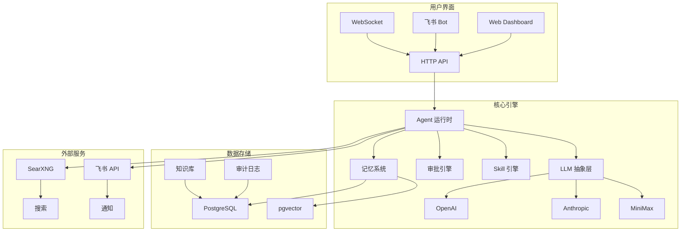

# ColoBot


> 单智能体 + 子智能体协作平台 — 多模态 AI + Skill 编排 + 飞书审批通知

**ColoBot** 是一个开源的 AI 智能体协作平台，支持多模态输入输出、Skill 编排、自动审批流程和飞书集成。它提供了完整的 AI 智能体管理和协作解决方案。

---

## ✨ 特性概览

<div align="center">

| 智能体管理 | Skill 编排 | 审批流程 | 集成支持 |
|-----------|------------|----------|----------|
| 🧠 父子智能体协作 | 📝 Markdown Skill 定义 | ⚖️ 四层审批漏斗 | 📱 飞书交互式卡片 |
| 🔄 上下文压缩 | 🚀 Trigger 引擎 | 📊 规则自进化 | 🔍 SearXNG 搜索 |
| 💾 向量记忆检索 | 🔧 工具白名单 | 📋 审计日志 | 🌐 WebSocket 实时通信 |

</div>

---

## 核心功能

| 模块 | 功能 | 状态 |
|------|------|------|
| **智能体** | 父Agent（全模态：文本/图片/音频/视频） | ✅ |
| | 子智能体（TTL 自动过期，工具白名单） | ✅ |
| | 消息路由 / 会话管理 | ✅ |
| **Trigger + Skill** | Trigger 引擎（cron/interval/webhook/condition） | ✅ |
| | Markdown Skill 定义 + 触发词激活 | ✅ |
| | Skill 自进化（提案→审批→应用） | ✅ |
| **AI 自进化** | Soul 自进化（对话中学习新能力） | ✅ |
| | 用户画像自进化（从对话中学习用户偏好） | ✅ |
| | SOP 流程自进化（用户偏好记忆 + 流程优化） | ✅ |
| **投毒防御** | 信任等级系统 + 内容验证 | ✅ |
| | 自动降级 + 回滚机制 | ✅ |
| **搜索** | SearXNG 多模态搜索 | ✅ |
| **记忆** | 向量语义检索 + 文本混合检索 | ✅ |
| **审批** | 规则自动审批（四层漏斗 + 自进化 + 审计） | ✅ |
| **飞书接入** | 交互式卡片 + 快捷审批按钮 | ✅ |
| **审计** | 操作审计日志 + API 查询 | ✅ |
| **Dashboard** | 飞书配置 / 模型 / Skill / 审批 / 审计 / 安全 | ✅ |
| **Fallback** | 链式 fallback + 跨 provider + 重试 | ✅ |
| **钉钉接入** | 规划中 | 📋 |

---

## 技术栈

| 层级 | 技术 |
|------|------|
| 运行时 | Node.js 22+ (TypeScript, ESM) |
| 数据库 | PostgreSQL + pgvector |
| LLM | OpenAI / Anthropic / MiniMax |
| 搜索 | SearXNG |
| 前端 | 单文件 HTML（无框架，零依赖） |
| 渠道 | 飞书 Bot（方案 B）|
| 认证 | API Key |

---

## 🏗️ 系统架构



---

## 🚀 快速开始

1. **克隆项目**
   ```bash
   git clone https://github.com/leobinjones-art/ColoBot.git
   cd colobot
   ```

2. **安装依赖**
   ```bash
   npm install
   ```

3. **配置环境变量**
   ```bash
   cp .env.example .env
   # 编辑 .env 填入必要的配置
   ```

4. **启动 PostgreSQL（需 pgvector 扩展）**
   ```bash
   docker compose up -d postgres
   ```

5. **初始化数据库**
   ```bash
   npm run db:init
   ```

6. **启动 ColoBot**
   ```bash
   npm run dev
   ```

访问 `http://localhost:18792` 打开 Dashboard。

> **注意**：需使用带 pgvector 扩展的 PostgreSQL 镜像（如 `pgvector/pgvector:pg18`）。

---

## 📋 SOP 学术研究流程

ColoBot 支持 AI 驱动的学术研究 SOP（标准操作流程），自动拆解任务、引导执行、审核结果。

### 配置管理

SOP 配置支持**前端可视化编辑**，无需修改代码或环境变量：

| 配置项 | 说明 | 编辑方式 |
|--------|------|----------|
| **Prompt 模板** | 任务分析、步骤引导、审核等 Prompt | Dashboard → SOP → 点击编辑 |
| **子 Agent 配置** | 各类型子 Agent 的性格、规则、技能、工具 | Dashboard → SOP → 点击编辑 |
| **LLM 默认配置** | 各 Provider 的默认模型和 API 端点 | Dashboard → LLM 查看 |

**配置优先级**：数据库 > 环境变量 > 默认值

> **简化部署**：开箱即用默认配置，通过 Dashboard 即可完成所有定制化配置。

### ⚠️ 免责声明

1. **AI 生成内容仅供参考**：SOP 流程中 AI 生成的文献推荐、分析结果、写作建议等均为辅助性质，用户需自行验证准确性。
2. **学术诚信责任**：用户应对最终提交的论文内容负责，确保符合学校学术规范，避免抄袭和学术不端。
3. **文献来源验证**：AI 推荐的文献可能存在幻觉，请务必通过正规学术数据库（知网、Web of Science 等）核实。
4. **不保证通过**：本工具仅提供流程引导，不保证论文质量或答辩结果。

### 触发方式

发送包含学术研究意图的消息，例如：
- "量子隧穿研究"
- "我的课题是关于XXX的研究"
- "帮我完成毕业论文"

### 研究目的

系统会询问您的研究目的，根据目的生成不同的步骤：

| 目的 | 说明 | 典型步骤 |
|------|------|----------|
| **写论文** | 发表期刊/毕业论文 | 文献调研→分析→撰写→投稿 |
| **做研究** | 科学研究、实验、分析 | 问题定义→方法设计→实验/计算→结果分析 |
| **学习** | 学习某个领域的知识 | 基础概念→深入学习→实践应用 |

### 流程指令

| 指令 | 说明 |
|------|------|
| `确认` | 确认任务拆解，开始执行 |
| `暂停` / `暂停sop` | 暂停 SOP 流程，保留进度 |
| `继续` / `继续sop` | 显示任务列表，选择恢复 |
| `新建sop` / `开始学术` | 开始新的 SOP 流程（会取消当前任务） |
| `退出sop` / `取消任务` | 取消 SOP 流程 |
| `重启步骤 N` | 重新执行第 N 步 |
| `sop列表` / `我的sop` | 查看所有进行中的 SOP 任务 |
| `修改步骤...` | 提出修改意见，重新拆解 |
| 发送编号（如 `1`） | 从列表中选择任务继续 |

### 特点

- **AI 动态拆解**：根据任务内容和研究目的自动生成步骤，无硬编码
- **研究目的区分**：写论文/做研究/学习，生成不同流程
- **子 Agent 协作**：每步创建专用子 Agent 处理
- **父 Agent 整理**：子 Agent 结果经父 Agent 整理汇总后呈现
- **AI 审核**：自动检测幻觉、验证逻辑连贯性
- **进度记忆**：每步结果保存到记忆，支持中断后继续
- **状态持久化**：支持暂停/恢复/重启
- **可视化配置**：Dashboard 直接编辑 Prompt 和子 Agent 配置，无需改代码

### 配置导出

Dashboard 支持一键导出 SOP 配置（JSON 格式），便于备份和迁移。

---

## 核心设计

### Fallback 链

```
primary model → fallback1 → fallback2 → ...
anthropic:claude-xxx,openai:gpt-4o-mini
支持跨 provider，自动重试 + exponential backoff
```

### 审批流

```
危险工具触发 → 四层漏斗检查 → 规则自动决策（auto_approve / auto_reject）
                                    ↓
                         所有决策写入审计日志
                         商业文书自动附加 [AI辅助生成，仅供参考]
```

**四层漏斗（规则自动决策，无人工等待）：**
1. **Tirith 规则** — 精确 regex/keyword 匹配，按 priority 优先级排序
2. **Pattern 历史** — 过去 7 天同类工具调用频率，高频 → 高风险
3. **用户行为自进化** — 用户批准/拒绝次数达到阈值，自动放行或拦截
4. **Smart LLM 裁决** — 兜底决策（返回 auto_approve / auto_reject）

### 投毒防御系统

自进化系统的安全防护机制：

| 信任等级 | 来源 | 处理方式 |
|---------|------|---------|
| **高** | 用户直接输入（审批后） | 直接使用 |
| **中** | AI 生成内容 | 内容监管扫描后使用 |
| **低** | 外部来源（URL/导入） | 最严格审核，需人工确认 |

**防御机制：**
- 写入时检测可疑模式（注入攻击、越狱等）
- AI 深度分析可疑内容
- 信任分数自动降级
- Dashboard 安全页面查看投毒尝试
- 支持一键回滚被污染内容

### Trigger 持久化

```
每次触发后：计算 next_fire_at → 持久化到 DB
重启时：检查 next_fire_at，如有错过立即补偿触发
```

### Dashboard Tab

```
飞书配置 | 模型设置 | Skill 仓库 | 审批管理 | 审计日志 | SubAgent | 安全中心
```

---

## 未来规划

### 模块化拆包（P0）

将 ColoBot 拆分为独立 npm 包，支持按需安装：

```
@colobot/core          # 核心：Agent、记忆、工具、LLM 抽象
@colobot/sop           # SOP 流程（可选）
@colobot/feishu        # 飞书集成（可选）
@colobot/dashboard     # Web 管理界面（可选）
@colobot/server        # 完整服务（整合包）
```

详见 [模块化拆包方案](docs/modular-packages.md)

### 安装示例

```bash
# 最小安装（仅核心）
npm install @colobot/core

# SOP 流程
npm install @colobot/core @colobot/sop

# 飞书集成
npm install @colobot/core @colobot/feishu

# 完整安装
npm install @colobot/server
```

### 功能规划

| 优先级 | 方向 | 说明 |
|--------|------|------|
| P1 | **钉钉接入** | 对称飞书方案 B，实现钉钉 Bot 交互式卡片 + 审批回调 |
| P3 | **用户角色体系** | admin / developer / readonly 等角色绑定 |
| P3 | **飞书命令式 Dashboard** | `/pending` `/approve` 等快捷命令在飞书内完成管理 |
| P2 | **审批自进化：隐私分级返回** | 位置请求返回模糊化数据（非全拒），摄像头前台可见时自动放行 |
| P2 | **审批自进化：跨规则关联学习** | 同一应用连续放行"网络请求+剪贴板"，自动降低该应用所有权限审批阈值 |
| P2 | **审批自进化：动态阈值试探性放行** | 批准N-1次时第N次静默放行，5分钟内无撤销则阈值+1，有撤销则阈值翻倍 |
| P2 | **审批自进化：AI 自主判断** | LLM 结合用户历史行为、当前对话上下文、系统健康状态综合判断，不局限于规则匹配 |
| P3 | **审批规则：Pattern DFA 编译优化** | 高频匹配词编译为 DFA 有限状态机，避免 regex 回溯影响性能 |

---

## 原创设计

以下是 ColoBot 独立设计/实现的核心特性：

| 特性 | 说明 |
|------|------|
| **父子 Agent 协作** | 父Agent 创建子Agent 处理子任务，TTL 自动过期，工具白名单/黑名单隔离 |
| **Trigger next_fire_at 持久化** | 每次触发后计算并持久化下次触发时间，重启后自动补偿漏触 |
| **多层审批漏斗** | Tirith规则(精确) → Pattern历史(7天频率) → Smart LLM裁决，三层漏斗减少误拦 |
| **审批流双向推送** | 飞书卡片（交互式按钮）+ WebSocket（实时刷新）同时推送 |
| **跨 Provider Fallback 链** | `provider:modelId` 格式，支持 OpenAI ↔ Anthropic ↔ MiniMax 任意切换 |
| **DB 驱动热配置** | 飞书/SubAgent 等配置写入 `app_settings` 表，无需重启即可保存 |
| **LLM 驱动的子Agent 配置** | 父Agent 自行判断任务难度，生成子Agent 的 soul/工具/TTL，无硬编码策略 |
| **审批状态卡片更新** | 审批通过/拒绝后，用 `message_id` 更新原飞书卡片颜色，无需重新发消息 |
| **流式 LLM 继续审批** | `continueRun()` 使用流式 `agentChatStream()` 继续被阻塞的 LLM 对话 |
| **知识库** | concept/template/rule 三类知识，Agent 可直接 add/search/list，跨 Agent 共享 |
| **Context Compression** | 历史超过 context_window * 0.8 时触发，LLM 总结旧消息保留关键信息，保留最近 6 条 |
| **ToolRegistry check_fn** | 工具权限细粒度控制，支持 RBAC (admin/developer/readonly) + 自定义权限函数 + require_approval |
| **投毒防御系统** | 信任等级判定 + 内容验证 + 自动降级 + 回滚机制，保护自进化系统安全 |

---

## 安全说明

**部署注意事项：**

- **数据持久化**：PostgreSQL 数据必须挂载到宿主机目录，否则容器删除后数据会丢失。推荐配置：
  ```bash
  docker run -d --name colobot-pg \
    -v /path/to/pg-data:/var/lib/postgresql \
    -e POSTGRES_PASSWORD=your_password \
    -e POSTGRES_USER=colobot \
    -e POSTGRES_DB=colobot \
    -p 5432:5432 pgvector/pgvector:pg18
  ```
  数据目录 `/path/to/pg-data` 包含所有数据库文件（agents、skills、triggers、knowledge_base、agent_memory 等）。
- **父 Agent 文件访问**：父 Agent 具有完整文件系统访问权限（子 Agent 有沙箱隔离）。建议通过工具注册时的 `requireAuth` 或 `toolRegistry.checkFn` 限制可执行文件操作的 Agent 范围，避免将完整文件工具暴露给不可信的 Agent。
- **API Key**：生产环境务必通过 `--api-keys` 或 `COLOBOT_API_KEY` 配置密钥，切勿将含真实密钥的 `.env` 提交到代码仓库。
- **飞书回调**：生产环境务必配置 `LARK_VERIFICATION_TOKEN` 并启用飞书事件验签，防止伪造回调。
- **公网暴露**：如需公网访问，建议在 ColoBot 前部署 Nginx/Caddy 做 TLS 终止和额外限流。
- **威胁卸载**：如用户多次要求删除或卸载 AI 系统，AI 会引导用户确认卸载操作，确认后自动清理程序及相关数据。

---

## 致谢 / 灵感来源

本项目部分设计参考了以下公开资料：

| 来源 | 参考内容 |
|------|----------|
| [Anthropic Cookbook](https://github.com/anthropics/anthropic-cookbook) | LLM 调用模式、流式处理、多模态 Content Block |
| [Model Context Protocol (MCP)](https://modelcontextprotocol.io/) | Tool/Skill 抽象概念 |
| [飞书开放平台文档](https://open.feishu.cn/document/server-docs/bots/bots/bots-overview) | 飞书 Bot API、交互式卡片 |
| pgvector + PostgreSQL | 向量存储方案 |
| [SearXNG](https://docs.searxng.org/) | 元搜索引擎 |

**原创设计声明**：以下特性为 ColoBot 团队独立设计，未参考其他项目：
- 父子 Agent 协作机制（TTL 过期、工具白名单）
- 四层审批漏斗 + 规则自进化
- 投毒防御系统（信任等级 + 自动降级）
- SOP 学术研究流程（AI 动态拆解 + 用户偏好记忆）
- Trigger next_fire_at 持久化 + 补偿触发
- 审批状态飞书卡片更新（无需重发消息）
- 跨 Provider Fallback 链

---

## 👥 社区与贡献

ColoBot 是一个开源项目，我们欢迎各种形式的贡献！

### 贡献方式
1. **报告问题** - 使用 [GitHub Issues](https://github.com/leobinjones-art/ColoBot/issues)
2. **提交代码** - 阅读 [贡献指南](CONTRIBUTING.md)
3. **改进文档** - 完善文档和示例
4. **分享用例** - 分享你的使用案例

### 行为准则
请阅读我们的 [行为准则](CODE_OF_CONDUCT.md)，确保社区友好和包容。

### 安全漏洞
如发现安全漏洞，请查看 [安全策略](SECURITY.md) 并按照指南报告。

### 获取帮助
- 📖 [文档](docs/) - 详细技术文档
- 💬 [讨论区](https://github.com/leobinjones-art/ColoBot/discussions) - 社区讨论
- 🐛 [问题跟踪](https://github.com/leobinjones-art/ColoBot/issues) - 报告Bug和功能请求

---

## 📄 License

Apache 2.0
