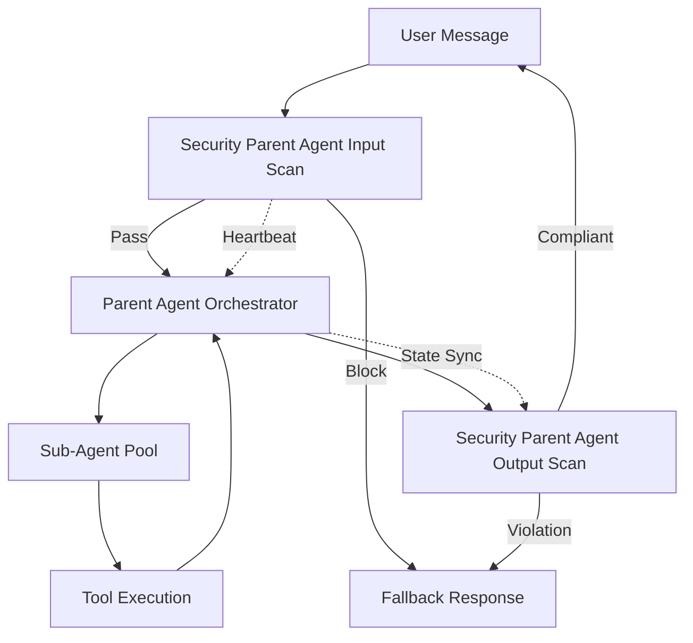

# ColoBot

<div align="center">

**TypeScript AI Agent Framework with Built-in Security Guardian**

Multi-modal AI × Security Parent Agent × Personal Assistant

[](LICENSE)
[](https://www.typescriptlang.org/)
[](https://nodejs.org/)

</div>

---

## Introduction

ColoBot is a **TypeScript AI Agent framework with built-in security guardian**.

It transforms the "personal assistant" concept into a programmable, extensible modular system, featuring an **industry-first independent security parent agent**.

You can quickly build an intelligent assistant that manages todos, writes papers, and codes - **without ever worrying about it saying something it shouldn't**.

---

## Why ColoBot

Most AI Agent frameworks focus on **how to call tools**, but overlook **how to call them safely** and **how to reuse domain knowledge**.

ColoBot solves three overlooked core problems from first principles:

| Problem | ColoBot's Solution |
|---------|-------------------|
| **Unbypassable Security** | Independent security parent agent guards all incoming/outgoing messages, no need to embed security checks in business code |
| **Reusable Knowledge** | SOP encapsulates complex workflows like "academic research" and "code refactoring" into shareable skill modules |
| **Modular to the Core** | 18 personal assistant modules (todo, notes, habits, etc.) ready to use, not just a tool registry |

### Core Features

- 🛡️ **Security Guardian**: Independent security parent agent with input/output scanning, process monitoring, and exception takeover
- 🤖 **Multi-LLM Support**: OpenAI, Anthropic, MiniMax, custom APIs
- 🧠 **Sub-Agent Collaboration**: Task decomposition, parallel execution, tool whitelisting
- 🖼️ **Multi-modal**: Text, images, audio
- 🐍 **Python WASM**: Pyodide sandbox execution, no system Python required
- 📋 **Personal Assistant**: 18 modules including todo, reminders, calendar, notes, habit tracking
- 🔧 **Tool System**: 20+ built-in tools, custom extension support
- 💾 **Memory System**: SQLite/PostgreSQL persistence, vector search

---

## Package Structure

```
colobot/
├── packages/
│   ├── types/           # Type definitions
│   ├── sentinel/        # Security Guardian Parent Agent
│   │   ├── rule-engine/ # Rule engine (Trie tree for sensitive words)
│   │   ├── heartbeat/   # Heartbeat protocol
│   │   ├── state/       # State synchronization
│   │   ├── signal/      # Takeover signals
│   │   └── redis/       # Distributed support
│   ├── core/            # Core runtime
│   │   ├── providers/   # LLM Providers
│   │   ├── runtime/     # Agent runtime
│   │   ├── memory/      # Memory system
│   │   ├── tools/       # Tool system (including Python WASM)
│   │   ├── subagents/   # Sub-agents
│   │   └── config/      # Configuration management
│   ├── assistant/       # Core assistant
│   │   ├── task/        # Todo, reminders
│   │   ├── schedule/    # Calendar
│   │   ├── knowledge/   # Notes, bookmarks
│   │   ├── life/        # Habits, mood, finance, health
│   │   ├── growth/      # Learning, reading, goals
│   │   ├── social/      # Contacts
│   │   ├── project/     # Projects
│   │   └── tools/       # Password, time tracking
│   ├── tui/             # Terminal UI
│   ├── sop-base/        # SOP flow engine base class
│   └── sop-academic/    # Academic SOP
└── _legacy/             # Legacy code (to be migrated)
```

---

## Quick Start

### Installation

```bash
# Clone repository
git clone https://github.com/your-repo/colobot.git
cd colobot

# Install dependencies
npm install

# Build
npm run build:packages
```

### Configuration

```bash
# Interactive configuration
npx colobot init

# Or manually create config file
mkdir -p ~/.colobot
cat > ~/.colobot/config.json << 'EOF'
{
  "model": {
    "provider": "openai",
    "model": "gpt-4o",
    "apiKey": "your-api-key"
  },
  "search": {
    "engine": "duckduckgo",
    "maxResults": 10
  },
  "subAgent": {
    "maxConcurrent": 10,
    "allowedTools": ["read_file", "write_file", "web_search"]
  }
}
EOF
```

### Run

```bash
# CLI mode
npx colobot

# TUI mode
npx colobot tui
```

---

## Feature Modules

### 🤖 Agent Core

| Feature | Description |
|---------|-------------|
| Multi-Provider | OpenAI / Anthropic / MiniMax / Mock |
| Fallback | Chain degradation, automatic model switching |
| Streaming | SSE streaming response support |
| Context Compression | Auto-compress history when exceeding window |
| Sub-Agent | Create, delegate, destroy sub-agents |
| Tool Whitelist | Sub-agent restricted permission control |

### 🛡️ Security Guardian (@colobot/sentinel)

Independent security parent agent with parallel chain architecture:


```mermaid
graph TD
    User[User Message] --> SentinelIn[Security Parent Agent Input Scan]
    SentinelIn -->|Pass| Parent[Parent Agent Orchestrator]
    SentinelIn -->|Block| Fallback[Fallback Response]
    Parent --> SubPool[Sub-Agent Pool]
    SubPool --> Tool[Tool Execution]
    Tool --> Parent
    Parent --> SentinelOut[Security Parent Agent Output Scan]
    SentinelOut -->|Compliant| User
    SentinelOut -->|Violation| Fallback
    SentinelIn -.->|Heartbeat| Parent
    Parent -.->|State Sync| SentinelOut
```

| Feature | Description |
|---------|-------------|
| **Input Scanning** | Trie tree sensitive words, regex patterns, length/frequency limits, <1ms response |
| **Output Scanning** | Async detection, deliver first then recall if issues |
| **Heartbeat Monitoring** | 2-second interval, 3 missed beats = dead |
| **State Synchronization** | Real-time parent agent state sync, full context on takeover |
| **Timeout Handling** | 30s warning → 60s inquiry → 120s takeover |
| **Three-Layer Defense** | Rule engine → Local model → LLM takeover |
| **Distributed** | Redis shared state, Pub/Sub signals |

```typescript
import { Sentinel } from '@colobot/sentinel'

const sentinel = new Sentinel()
sentinel.start()

// Input scanning
const result = sentinel.scanInput(userMessage, sessionId)
if (!result.pass) {
  return sentinel.scanInputWithTakeover(userMessage, sessionId).response
}

// Timeout monitoring
sentinel.startSessionTimeout(sessionId, agentId)
```

### 🚀 High Concurrency & Scalability

- **Sub-Agent Pooling**: Semaphore-based concurrency control, configurable limit, defaults to CPU cores
- **Async Non-blocking**: Parent agent is pure orchestrator, all heavy computation in Worker Threads or separate processes
- **Distributed Ready**: Multi-instance deployment via Redis Pub/Sub and shared state, security parent agent can scale independently

### 🐍 Python WASM Sandbox

| Feature | Description |
|---------|-------------|
| No System Python | Pyodide runs in WebAssembly |
| Cross-platform | Consistent behavior on macOS/Linux/Windows |
| Secure Isolation | WASM sandbox provides natural isolation |
| Dynamic Package Installation | Supports numpy, pandas, matplotlib, etc. |

```typescript
// Execute Python code
const result = await toolRegistry.get('python')!.execute({
  code: `
import numpy as np
arr = np.array([1, 2, 3])
print(arr.sum())
  `,
  packages: ['numpy'],
})
```

### 📋 Personal Assistant (@colobot/assistant)

| Module | Features |
|--------|----------|
| **Todo List** | Create, priority, due dates, tags |
| **Reminders** | Scheduled, recurring, natural language creation |
| **Calendar** | Calendar view, conflict detection, weekly/monthly views |
| **Notes** | Markdown, tags, full-text search |
| **Habit Tracking** | Check-in, streak count, statistics |
| **Mood Journal** | Mood recording, trend analysis |
| **Finance** | Income/expense tracking, category statistics |
| **Health Tracking** | Exercise, sleep, weight, water intake |
| **Learning Progress** | Course management, progress tracking |
| **Reading List** | Books/articles, reading progress |
| **Goals** | Goal setting, progress tracking |
| **Inspiration Notes** | Quick capture, tag classification |
| **Contacts** | Contact info, interaction records |
| **Projects** | Project tracking, milestones |
| **Password Manager** | AES encryption, password generation |
| **Time Tracking** | Start/stop, category statistics |
| **Web Bookmarks** | URL, summary, tags |
| **Intent Recognition** | Natural language understanding |

### 🔧 Built-in Tools

```
read_file      - Read file
write_file     - Write file
list_dir       - List directory
python         - Execute Python (WASM sandbox)
shell          - Execute shell commands
web_search     - Web search
http           - HTTP requests
add_memory     - Add memory
search_memory  - Search memory
spawn_subagent - Create sub-agent
delegate_task  - Delegate task
...
```

---

## Programmatic Usage

### Basic Runtime

```typescript
import { AgentRuntime, OpenAIProvider, SQLiteStore } from '@colobot/core'

const runtime = new AgentRuntime({
  llm: new OpenAIProvider({ apiKey: 'your-key', defaultModel: 'gpt-4o' }),
  memory: new SQLiteStore({ path: '~/.colobot/chat.db' }),
})

const result = await runtime.run({
  agentId: 'my-agent',
  sessionKey: 'session-1',
  userMessage: 'Hello',
})

console.log(result.response)
```

### Python Execution

```typescript
import { PyodideRuntime } from '@colobot/core/tools'

const runtime = new PyodideRuntime()
const { output, error } = await runtime.runCode(`
import numpy as np
print(np.array([1, 2, 3]).sum())
`)

// Dynamic package installation
await runtime.installPackage('matplotlib')
```

### Using Assistant Features

```typescript
import { createTodo, createReminderFromText, logMood, parseIntent } from '@colobot/assistant'

// Create todo
const todo = createTodo({
  userId: 'user1',
  title: 'Complete report',
  priority: 'high',
  dueDate: '2024-12-31',
})

// Natural language reminder creation
const reminder = createReminderFromText('user1', 'Remind me to meet at 3pm tomorrow')

// Log mood
logMood('user1', 'happy', 8, 'Great day today')

// Intent recognition
const intent = parseIntent('Add todo Complete report')
// { type: 'todo.add', confidence: 0.9 }
```

---

## SOP Open Source Ecosystem

ColoBot supports pluggable SOP (Standard Operating Procedure) flow modules for encapsulating complex multi-step tasks.

### Architecture

```
@colobot/sop-base          # Flow engine base class (Official)
@colobot/sop-academic      # Academic research flow (Official example)
colobot-sop-*              # Community contributions (npm publish)
```

### Official SOP Modules

| Module | Scenario | Status |
|--------|----------|--------|
| `@colobot/sop-base` | Flow engine base class | ✅ Implemented |
| `@colobot/sop-academic` | Paper writing, literature research | ✅ Implemented |
| `@colobot/sop-writing` | Long-form writing, report generation | 📋 Planned |
| `@colobot/sop-coding` | Project development, code refactoring | 📋 Planned |

### @colobot/sop-base Core Concepts

#### Type Definitions

```typescript
// Task status
type SopTaskStatus = 'created' | 'analyzing' | 'ready' | 'running' | 'paused' | 'completed' | 'failed' | 'cancelled'

// Step definition
interface SopStep {
  id: string
  name: string
  description: string
  status: 'pending' | 'in_progress' | 'completed' | 'failed' | 'skipped'
  dependencies?: string[]      // Dependent step IDs
  data?: Record<string, unknown>
}

// Task definition
interface SopTask {
  id: string
  type: string
  description: string
  status: SopTaskStatus
  steps: SopStep[]
  currentStepIndex: number
  context: Record<string, unknown>
  output?: string
}
```

#### SopEngine Base Class

```typescript
import { SopEngine } from '@colobot/sop-base'

class MySopEngine extends SopEngine {
  // Must implement: analyze user request, return step list
  async analyzeTask(userMessage: string, context?: Record<string, unknown>): Promise<TaskAnalysis> {
    return {
      type: 'my-task',
      description: 'Task description',
      steps: [
        { name: 'step-1', description: 'First step' },
        { name: 'step-2', description: 'Second step', dependencies: ['step-1'] },
      ],
    }
  }
}

// Usage
const engine = new MySopEngine({ name: 'my-sop', version: '1.0.0' })
const task = await engine.createTask('User request')
await engine.startTask(task.id)
```

#### Core Methods

| Method | Description |
|--------|-------------|
| `createTask(message, context)` | Create task |
| `startTask(taskId)` | Start task |
| `pauseTask(taskId)` | Pause task |
| `resumeTask(taskId)` | Resume task |
| `cancelTask(taskId)` | Cancel task |
| `getCurrentStep(taskId)` | Get current step |
| `advanceStep(taskId)` | Advance to next step |
| `submitStepData(taskId, stepId, data)` | Submit step data |
| `generateOutput(taskId)` | Generate final output |

#### Event System

```typescript
const engine = new MySopEngine(
  { name: 'my-sop', version: '1.0.0' },
  {
    onTaskCreated: (task) => console.log('Task created:', task.id),
    onStepStarted: (task, step) => console.log('Step started:', step.name),
    onStepCompleted: (task, step) => console.log('Step completed:', step.name),
    onTaskCompleted: (task) => console.log('Task completed:', task.output),
  }
)
```

### Developing an SOP Package

#### 1. Create Package Structure

```
colobot-sop-my-domain/
├── package.json
├── tsconfig.json
└── src/
    ├── index.ts          # Export engine
    ├── engine.ts         # Engine implementation
    ├── prompts.ts        # Prompt templates (optional)
    └── __tests__/
        └── index.test.ts
```

#### 2. package.json

```json
{
  "name": "@your-org/sop-my-domain",
  "version": "1.0.0",
  "type": "module",
  "main": "dist/index.js",
  "types": "dist/index.d.ts",
  "dependencies": {
    "@colobot/sop-base": "^0.1.0",
    "@colobot/core": "^0.3.0"
  }
}
```

#### 3. Implement Engine

```typescript
// src/engine.ts
import { SopEngine, type TaskAnalysis } from '@colobot/sop-base'

export class MyDomainSopEngine extends SopEngine {
  constructor() {
    super({ name: 'my-domain', version: '1.0.0' })
  }

  async analyzeTask(userMessage: string, context?: Record<string, unknown>): Promise<TaskAnalysis> {
    // 1. Analyze user intent
    const intent = await this.detectIntent(userMessage)
    
    // 2. Generate step list
    return {
      type: intent.type,
      description: userMessage,
      steps: [
        { name: 'analyze', description: 'Analyze requirements' },
        { name: 'collect', description: 'Collect information', dependencies: ['analyze'] },
        { name: 'generate', description: 'Generate result', dependencies: ['collect'] },
      ],
      requiredTools: ['web_search', 'read_file', 'write_file'],
      estimatedTime: 10,
      complexity: 5,
    }
  }

  private async detectIntent(message: string): Promise<{ type: string }> {
    // Implement intent detection logic
    return { type: 'my-domain-task' }
  }
}
```

#### 4. Export

```typescript
// src/index.ts
export { MyDomainSopEngine } from './engine.js'
```

#### 5. Register Step Executors (Optional)

```typescript
// Custom step execution logic
engine.registerStepExecutor('analyze', async (step, task, context) => {
  // Execute analysis logic
  const result = await doAnalysis(task.context)
  return { analysisResult: result }
})

engine.registerStepExecutor('collect', async (step, task, context) => {
  // Collect information based on previous step result
  const analysis = task.steps.find(s => s.id === 'analyze')?.data?.analysisResult
  const info = await collectInfo(analysis)
  return { collectedInfo: info }
})
```

### Prompt Templates

sop-base provides built-in prompt templates:

```typescript
import { 
  TASK_ANALYSIS_PROMPT, 
  STEP_EXECUTION_PROMPT, 
  OUTPUT_GENERATION_PROMPT,
  buildPrompt 
} from '@colobot/sop-base'

// Use template
const prompt = buildPrompt(TASK_ANALYSIS_PROMPT, {
  userMessage: 'Help me write a paper',
  context: JSON.stringify({ field: 'AI' }),
  maxSteps: 10,
})
```

### Publish to npm

```bash
# Build
npm run build

# Publish
npm publish --access public
```

### Use Community SOP

```bash
npm install @community/sop-xxx
```

```typescript
import { XxxSopEngine } from '@community/sop-xxx'

const engine = new XxxSopEngine()
const task = await engine.createTask('User request')
await engine.startTask(task.id)
```

---

## Development Guide

### Development Commands

```bash
# Build all packages
npm run build:packages

# Build single package
npm run build --workspace=packages/core

# Run tests
npm test

# Type check
npx tsc --noEmit
```

### Adding New Tools

```typescript
// packages/core/src/tools/my-tool.ts
import { toolRegistry } from './registry.js'

export function registerMyTool(): void {
  toolRegistry.register({
    name: 'my_tool',
    description: 'My custom tool',
    parameters: {
      type: 'object',
      properties: {
        input: { type: 'string', description: 'Input' },
      },
      required: ['input'],
    },
    execute: async (args, ctx) => {
      return 'result'
    },
  })
}
```

---

## Project Statistics

| Metric | Value |
|--------|-------|
| Version | 0.3.0 |
| Total Code | ~28,000 lines TypeScript |
| Source Files | 145 |
| Packages | 7 |
| Assistant Modules | 18 |
| Test Cases | 522 |
| Test Coverage | 56%+ |

---

## Environment Variables

| Variable | Description |
|----------|-------------|
| `OPENAI_API_KEY` | OpenAI API Key |
| `ANTHROPIC_API_KEY` | Anthropic API Key |
| `MINIMAX_API_KEY` | MiniMax API Key |
| `COLOBOT_LOG_LEVEL` | Log level (debug/info/warn/error) |
| `COLOBOT_LOG_CONSOLE` | Output to console (true/false) |
| `COLOBOT_ENCRYPTION_KEY` | Password encryption key |

---

## License

[AGPL-3.0](LICENSE)

---

## Contributing

Issues and Pull Requests are welcome!

---

## Acknowledgments

- [OpenAI](https://openai.com/)
- [Anthropic](https://www.anthropic.com/)
- [Pyodide](https://pyodide.org/)
- [better-sqlite3](https://github.com/WiseLibs/better-sqlite3)
- [llm-guard](https://github.com/protectai/llm-guard)
- [Tesseract.js](https://github.com/naptha/tesseract.js)
- [@xenova/transformers](https://github.com/xenova/transformers.js)
