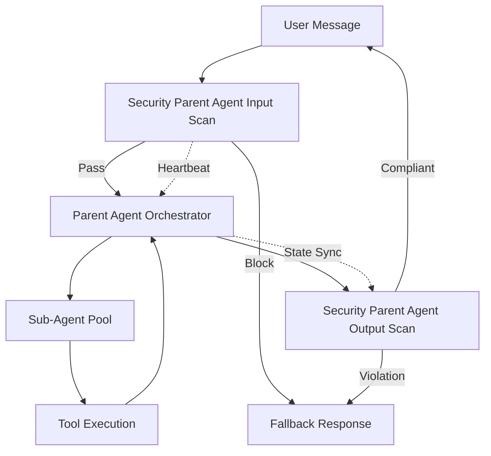

# ColoBot

<div align="center">

**TypeScript AI Agent Framework with Built-in Security Guardian**

Multi-modal AI × Security Parent Agent × Charter License System

[](LICENSE)
[](https://www.typescriptlang.org/)
[](https://nodejs.org/)

</div>

---

## Introduction

ColoBot is a **TypeScript AI Agent framework with built-in security guardian**.

It transforms the "personal assistant" concept into a programmable, extensible modular system, featuring an **industry-first independent security parent agent** and **Charter license system**.

You can quickly build an intelligent assistant that manages todos, writes papers, and codes - **without ever worrying about it saying something it shouldn't**.

---

## Core Architecture

```
┌─────────────────────────────────────────────────────────────────┐
│                         应用层                                   │
│  frontend (Vue 3)  │  tui (终端UI)  │  server (API服务)         │
└─────────────────────────────────────────────────────────────────┘
                              │
┌─────────────────────────────────────────────────────────────────┐
│                         安全层                                   │
│  sentinel - 独立安全守护，平行链路，不参与业务逻辑               │
└─────────────────────────────────────────────────────────────────┘
                              │
┌─────────────────────────────────────────────────────────────────┐
│                         许可层                                   │
│  charter - 许可证系统，定义AI能力边界，绑定文档库防幻觉          │
└─────────────────────────────────────────────────────────────────┘
                              │
┌─────────────────────────────────────────────────────────────────┐
│                         运行时层                                 │
│  core - Agent运行时、LLM调用、工具执行、子Agent管理              │
└─────────────────────────────────────────────────────────────────┘
                              │
┌─────────────────────────────────────────────────────────────────┐
│                         基础层                                   │
│  types - 共享类型定义，零依赖                                    │
└─────────────────────────────────────────────────────────────────┘
```

---

## Key Features

### Charter License System

**Define what AI can do** through licenses:

```typescript
import { charterManager } from '@colobot/charter'

// Request a license
const instance = charterManager.requestCharter(userId, {
  type: 'academic',
  reason: 'Writing a paper'
})

// Check capability
const result = charterManager.checkCapability(userId, 'paper-writing')
if (result.allowed) {
  // Get relevant document library entries (prevent hallucination)
  const library = charterManager.getCharterLibrary(result.charter.charterId)
}
```

**Built-in Charters**:
- `academic` - Paper writing, literature review, citation formatting
- `legal` - Contract drafting, disclaimer generation, legal analysis
- `longdoc` - Long document processing with partition support

### Sentinel Security Guardian

**Independent security layer** that never participates in business logic:

```typescript
import { Sentinel, CharterGuard } from '@colobot/sentinel'

const sentinel = new Sentinel()
const guard = new CharterGuard()

// Input scanning (< 1ms)
const result = sentinel.scanInput(userMessage)

// Charter permission check
const capResult = guard.checkCapability(userId, 'paper-writing')
```

### Sub-Agent Architecture

**Break LLM context limits** for large file processing:

```typescript
import { readChunksByTokens, runSubAgentTask } from '@colobot/core'

const chunks = readChunksByTokens(largeFile, { maxTokens: 10000 })
const results = await Promise.all(
  chunks.map(chunk => runSubAgentTask({ task: 'analyze', input: chunk }))
)
```

---

## Philosophy: Not Imitating People — Sharing Their Role

Most AI projects pursue "making AI more human-like" at the surface level: more human-like tone, expressions, and chitchat ability. ColoBot goes deeper — into the role AI can play in your life:

### 1. Perceives Your State, Doesn't Wait for You to Describe It

A human friend doesn't need you to tell them "I've been feeling down lately." They see you sleeping less, going out less, talking less — and they just know. ColoBot's real-time evaluation does exactly this: AI doesn't need you to speak up; it can recognize the shift on its own.

### 2. Reaches Out When You're Slipping, Not When You Ask for Help

A human friend won't wait for you to say "I need help" before caring. Seeing your state, they'll ask "Are you okay?" The passive suggestions in v0.4 and confirmation-based sending in v0.5 are essentially training AI to "care proactively." This isn't a cold function trigger — it's simulating the most precious part of human friendship: _I saw it before you had to say it._

### 3. Always Respects Your Boundaries

A real human friend, when caring about you, doesn't make decisions for you. They say "Want me to help you contact someone?" — not make the call on your behalf. v0.4 (suggest only), v0.5 (confirm before send), and v0.6 (strict conditional auto-send) all answer the same question: _How far can AI go in acting for the user?_ The answer is always: _A bit more than the previous level, but never over the line._

### 4. Takes Responsibility for Its Actions

A mature person leaves traces, accepts scrutiny. Sentinel's audit logs, pre-send review, and automatic shutdown on anomalies — these add accountability to AI's "personality." It's not an unconstrained superpower; it's a partner with constraints, traceability, and accountability.

---

**In one sentence**: ColoBot is not about making AI sound more human. It's about making AI more like a friend who cares about you — and always respects you.

This "human-likeness" isn't achieved through larger models or fancier prompts. It's achieved through **architecture** — real-time evaluation, privacy boundaries, security parent agent, progressive autonomy — growing from the foundation up.

_This is perhaps the deepest difference between ColoBot and all other AI frameworks._

---

## Why ColoBot

Most AI Agent frameworks focus on **how to call tools**, but overlook **how to call them safely** and **how to prevent hallucination**.

ColoBot solves three overlooked core problems from first principles:

| Problem                   | ColoBot's Solution                                                                                                         |
| ------------------------- | -------------------------------------------------------------------------------------------------------------------------- |
| **Unbypassable Security** | Independent Sentinel agent guards all messages, can takeover on anomaly                                                    |
| **Hallucination Prevention** | Charter license + document library = evidence-based output                                                              |
| **Modular to the Core**   | 18 personal assistant modules (todo, notes, habits, etc.) ready to use, not just a tool registry                           |

### Core Features

- 🛡️ **Security Guardian**: Independent Sentinel agent with input/output scanning, process monitoring, and exception takeover
- 📜 **Charter System**: License-based capability unlocking with document library support
- 🤖 **Multi-LLM Support**: OpenAI, Anthropic, MiniMax, custom APIs
- 🧠 **Dynamic Orchestration**: AI dynamically manages workflows, no preset SOP needed
- 🖼️ **Multi-modal**: Text, images, audio
- 🐍 **Python WASM**: Pyodide sandbox execution, no system Python required
- 📋 **Personal Assistant**: 18 modules including todo, reminders, calendar, notes, habit tracking
- 🔧 **Tool System**: 20+ built-in tools, custom extension support
- 💾 **Memory System**: SQLite/PostgreSQL persistence, vector search

---

## Package Structure

```
colobot/
├── packages/
│   ├── types/           # Type definitions
│   ├── sentinel/        # Security Guardian (Bypass Architecture)
│   │   ├── rule-engine/ # Rule engine (Trie tree for sensitive words)
│   │   ├── heartbeat/   # Heartbeat protocol
│   │   ├── state/       # State synchronization
│   │   ├── signal/      # Takeover signals
│   │   └── redis/       # Distributed support
│   ├── core/            # Core runtime
│   │   ├── providers/   # LLM Providers
│   │   ├── runtime/     # Agent runtime
│   │   ├── memory/      # Memory system
│   │   ├── tools/       # Tool system (including Python WASM)
│   │   └── config/      # Configuration management
│   ├── charter/         # Charter License System (Planned)
│   │   ├── charters/    # License definitions
│   │   └── libraries/   # Document libraries
│   ├── assistant/       # Personal assistant modules
│   │   ├── task/        # Todo, reminders
│   │   ├── schedule/    # Calendar
│   │   ├── knowledge/   # Notes, bookmarks
│   │   ├── life/        # Habits, mood, finance, health
│   │   ├── growth/      # Learning, reading, goals
│   │   ├── social/      # Contacts
│   │   ├── project/     # Projects
│   │   └── tools/       # Password, time tracking
│   ├── tui/             # Terminal UI
│   └── frontend/        # Vue 3 Web UI
└── _legacy/             # Legacy code (to be migrated)
```

---

## Quick Start

### Installation

```bash
# Clone repository
git clone https://github.com/your-repo/colobot.git
cd colobot

# Install dependencies
npm install

# Build
npm run build:packages
```

### Configuration

```bash
# Interactive configuration
npx colobot init

# Or manually create config file
mkdir -p ~/.colobot
cat > ~/.colobot/config.json << 'EOF'
{
  "model": {
    "provider": "openai",
    "model": "gpt-4o",
    "apiKey": "your-api-key"
  },
  "search": {
    "engine": "duckduckgo",
    "maxResults": 10
  },
  "subAgent": {
    "maxConcurrent": 10,
    "allowedTools": ["read_file", "write_file", "web_search"]
  }
}
EOF
```

### Run

```bash
# CLI mode
npx colobot

# TUI mode
npx colobot tui
```

---

## Feature Modules

### 🤖 Agent Core

| Feature             | Description                                  |
| ------------------- | -------------------------------------------- |
| Multi-Provider      | OpenAI / Anthropic / MiniMax / Mock          |
| Fallback            | Chain degradation, automatic model switching |
| Streaming           | SSE streaming response support               |
| Context Compression | Auto-compress history when exceeding window  |
| Sub-Agent           | Create, delegate, destroy sub-agents         |
| Tool Whitelist      | Sub-agent restricted permission control      |

### 🛡️ Security Guardian (@colobot/sentinel)

Independent security parent agent with parallel chain architecture:


```mermaid
graph TD
    User[User Message] --> SentinelIn[Security Parent Agent Input Scan]
    SentinelIn -->|Pass| Parent[Parent Agent Orchestrator]
    SentinelIn -->|Block| Fallback[Fallback Response]
    Parent --> SubPool[Sub-Agent Pool]
    SubPool --> Tool[Tool Execution]
    Tool --> Parent
    Parent --> SentinelOut[Security Parent Agent Output Scan]
    SentinelOut -->|Compliant| User
    SentinelOut -->|Violation| Fallback
    SentinelIn -.->|Heartbeat| Parent
    Parent -.->|State Sync| SentinelOut
```

| Feature                   | Description                                                                       |
| ------------------------- | --------------------------------------------------------------------------------- |
| **Input Scanning**        | Trie tree sensitive words, regex patterns, length/frequency limits, <1ms response |
| **Output Scanning**       | Async detection, deliver first then recall if issues                              |
| **Heartbeat Monitoring**  | 2-second interval, 3 missed beats = dead                                          |
| **State Synchronization** | Real-time parent agent state sync, full context on takeover                       |
| **Timeout Handling**      | 30s warning → 60s inquiry → 120s takeover                                         |
| **Three-Layer Defense**   | Rule engine → Local model → LLM takeover                                          |
| **Distributed**           | Redis shared state, Pub/Sub signals                                               |

```typescript
import { Sentinel } from '@colobot/sentinel'

const sentinel = new Sentinel()
sentinel.start()

// Input scanning
const result = sentinel.scanInput(userMessage, sessionId)
if (!result.pass) {
  return sentinel.scanInputWithTakeover(userMessage, sessionId).response
}

// Timeout monitoring
sentinel.startSessionTimeout(sessionId, agentId)
```

### 🚀 High Concurrency & Scalability

- **Sub-Agent Pooling**: Semaphore-based concurrency control, configurable limit, defaults to CPU cores
- **Async Non-blocking**: Parent agent is pure orchestrator, all heavy computation in Worker Threads or separate processes
- **Distributed Ready**: Multi-instance deployment via Redis Pub/Sub and shared state, security parent agent can scale independently

### 🐍 Python WASM Sandbox

| Feature                      | Description                                |
| ---------------------------- | ------------------------------------------ |
| No System Python             | Pyodide runs in WebAssembly                |
| Cross-platform               | Consistent behavior on macOS/Linux/Windows |
| Secure Isolation             | WASM sandbox provides natural isolation    |
| Dynamic Package Installation | Supports numpy, pandas, matplotlib, etc.   |

```typescript
// Execute Python code
const result = await toolRegistry.get('python')!.execute({
  code: `
import numpy as np
arr = np.array([1, 2, 3])
print(arr.sum())
  `,
  packages: ['numpy'],
})
```

### 📋 Personal Assistant (@colobot/assistant)

> ⚠️ **隐私提示**
>
> `@colobot/assistant` 是一个**可选包**。安装后，ColoBot 会在每次对话中自动携带以下维度的用户数据作为上下文：
>
> - 心理状态（情绪日记、心情趋势）
> - 生活习惯（习惯追踪、睡眠、运动）
> - 工作效率（待办、时间追踪）
> - 社交关系（人脉管理）
> - 财务状况（收支记录）
> - 健康状况（运动、睡眠、体重、饮水）
> - 成长目标（学习进度、阅读清单、目标管理）
>
> 这些数据**全部存储在本地**（SQLite/PostgreSQL），不会上传到任何云端服务。
>
> 如果你不希望 AI 读取这些数据，**请不要安装 `@colobot/assistant` 包**。ColoBot 的核心框架（`@colobot/core` + `@colobot/sentinel`）不会收集或注入任何个人数据。
>
> 已安装用户可以通过 `/context` 命令查看当前会话携带了哪些上下文维度。

| Module                 | Features                                                |
| ---------------------- | ------------------------------------------------------- |
| **Todo List**          | Create, priority, due dates, tags                       |
| **Reminders**          | Scheduled, recurring, natural language creation         |
| **Calendar**           | Calendar view, conflict detection, weekly/monthly views |
| **Notes**              | Markdown, tags, full-text search                        |
| **Habit Tracking**     | Check-in, streak count, statistics                      |
| **Mood Journal**       | Mood recording, trend analysis                          |
| **Finance**            | Income/expense tracking, category statistics            |
| **Health Tracking**    | Exercise, sleep, weight, water intake                   |
| **Learning Progress**  | Course management, progress tracking                    |
| **Reading List**       | Books/articles, reading progress                        |
| **Goals**              | Goal setting, progress tracking                         |
| **Inspiration Notes**  | Quick capture, tag classification                       |
| **Contacts**           | Contact info, interaction records                       |
| **Projects**           | Project tracking, milestones                            |
| **Password Manager**   | AES encryption, password generation                     |
| **Time Tracking**      | Start/stop, category statistics                         |
| **Web Bookmarks**      | URL, summary, tags                                      |
| **Intent Recognition** | Natural language understanding (Chinese & English)      |
| **Logging System**     | Unified logging with level control for all modules      |
| **User Profile**       | 🧠 Comprehensive user profiling integrating all modules |

#### 🧠 User Profile Analysis

The `@colobot/assistant` package provides comprehensive user profiling:

```typescript
import { generateUserProfile } from '@colobot/assistant'

const profile = generateUserProfile(userId, {
  moods,
  habits,
  todos,
  goals,
  contacts,
  finances,
  healthEntries,
  notes,
  events,
})

// Profile includes:
// - Psychological: mood score, trend, risk assessment, insights
// - Lifestyle: habit streaks, consistency, check-in rate
// - Productivity: task completion, overdue count, efficiency
// - Social: contact count, interaction frequency, relationship health
// - Financial: income/expense, savings rate, spending categories
// - Health: exercise frequency, sleep average, health score
// - Growth: goal progress, near-deadline alerts
// - AI Context: formatted summary for AI agents
```

**AI Agent Integration**: The `aiContext` field provides a formatted summary that AI agents can use to understand the user's current state and provide personalized responses.

**Chat Integration**: The frontend Chat Console automatically includes user profile context in every message, allowing AI agents to:

- Understand user's psychological state (mood, stress level, risk factors)
- Reference user's habits, goals, and productivity patterns
- Provide personalized suggestions based on financial and health data
- Adapt responses to user's current life situation

### 🖥️ Web UI (@colobot/frontend)

Vue 3 + TypeScript web interface with modern design and creative interactions:

| Page             | Features                                                                                                                                     |
| ---------------- | -------------------------------------------------------------------------------------------------------------------------------------------- |
| **Chat Console** | SSE streaming, tool call visualization, typing cursor animation, message fade-in, **🧠 user profile context integration**                    |
| **Agents**       | CRUD management, icon picker, model selection, system prompt config                                                                          |
| **Skills**       | Type filters (SOP/Tool/Agent), icon picker, security status, JSON definition                                                                 |
| **Sentinel**     | Status dashboard, three-layer defense visualization, session monitoring, takeover history                                                    |
| **Todos**        | Ring progress chart, quick filters, priority borders, animations                                                                             |
| **Reminders**    | Time picker, repeat options, complete/delete actions                                                                                         |
| **Calendar**     | Event management, date/time picker                                                                                                           |
| **Notes**        | Markdown editor, tag management, search, delete                                                                                              |
| **Habits**       | 🔥 Streak banner with fire animation, week view, achievement system (first check-in, 7/30 day streak, all complete)                          |
| **Moods**        | 📊 Calendar heatmap, mood statistics (average score, streak days, most frequent), smart hints, trend chart, **🧠 AI psychological analysis** |
| **Goals**        | Progress rings, milestones, urgency alerts                                                                                                   |
| **Finances**     | ECharts trend/pie charts, category breakdown                                                                                                 |
| **Contacts**     | CRUD management, search, tags                                                                                                                |
| **Settings**     | System config, feature toggles, cache management, data export                                                                                |
| **Models**       | Provider management, model enable/disable, connection test, add custom models                                                                |

**Tech Stack**: Vue 3 + Vite + Pinia + Vue Router + ECharts + SSE + highlight.js + DOMPurify

**Creative Components**:

- `StreamProgress` - Streaming phase visualization (thinking, tool execution, etc.)
- `ToolCallCard` - Tool call display with status, arguments, results
- `ProviderCard` - LLM provider card with model list
- `CommandPalette` - Quick command access (⌘K)
- `AchievementToast` - 🏆 Achievement celebration with golden glow, rotating light, sparkle particles

**Architecture**:

```
packages/frontend/
├── src/
│   ├── views/           # 19 page components
│   │   ├── ChatConsole.vue
│   │   ├── Agents.vue
│   │   ├── Skills.vue
│   │   ├── Sentinel.vue
│   │   ├── Login.vue
│   │   ├── Assistant/   # 8 assistant pages
│   │   ├── Settings/    # System & Models
│   │   └── layout/
│   ├── components/
│   │   ├── chat/        # StreamProgress, ToolCallCard
│   │   ├── settings/    # ProviderCard
│   │   └── common/      # CommandPalette, AchievementToast
│   ├── api/             # 15 API modules
│   ├── types/           # TypeScript definitions
│   ├── stores/          # Pinia stores (agent, theme)
│   ├── composables/     # Markdown renderer, useChat
│   ├── utils/           # Auth utilities
│   └── i18n/            # Internationalization (zh-CN)
├── mock-server.ts       # Mock API for development
└── dist/                # Production build
```

**Creative Features**:

- 🏆 **Achievement System**: Pop-up celebration for habit milestones with golden border, rotating glow, and sparkle particles
- 🔥 **Streak Animation**: Pulsing fire emoji for habit streaks
- ⌨️ **Typing Cursor**: Blinking cursor effect during AI response generation
- 📊 **Mood Heatmap**: Calendar heatmap with mood colors and intensity based on score
- 💡 **Smart Hints**: Contextual suggestions based on recent mood trends
- 🧠 **Psychological Analysis**: AI-powered mood analysis with:
  - Overall psychological score (0-100) with ring visualization
  - Trend analysis (improving/stable/declining/fluctuating)
  - Pattern recognition (weekday patterns, consecutive low moods, anxiety triggers)
  - Risk assessment with early warning system
  - Personalized suggestions based on mood data
  - Context generation for AI agent to understand user's emotional state
- 🤖 **Chat Context Integration**: User profile automatically included in chat messages for personalized AI responses
- 🎨 **Message Animations**: Fade-in and slide-up effects for new messages

**Development**:

```bash
# Development with mock API
cd packages/frontend
npm run dev        # Frontend on :5173
npx tsx mock-server.ts  # Mock API on :3000

# Build for production
npm run build

# Deploy
serve -l 5173 dist
# Connect to real ColoBot Core backend
```

**Mock API Coverage**: Auth, Agents, Chat (SSE), Todos, Reminders, Events, Notes, Habits, Moods, Finances, Goals, Contacts, Skills, Sentinel, Config, **User Profile**

### 🔧 Built-in Tools

```
read_file      - Read file
write_file     - Write file
list_dir       - List directory
python         - Execute Python (WASM sandbox)
shell          - Execute shell commands
web_search     - Web search
http           - HTTP requests
add_memory     - Add memory
search_memory  - Search memory
spawn_subagent - Create sub-agent
delegate_task  - Delegate task
...
```

---

## Programmatic Usage

### Basic Runtime

```typescript
import { AgentRuntime, OpenAIProvider, SQLiteStore } from '@colobot/core'

const runtime = new AgentRuntime({
  llm: new OpenAIProvider({ apiKey: 'your-key', defaultModel: 'gpt-4o' }),
  memory: new SQLiteStore({ path: '~/.colobot/chat.db' }),
})

const result = await runtime.run({
  agentId: 'my-agent',
  sessionKey: 'session-1',
  userMessage: 'Hello',
})

console.log(result.response)
```

### Python Execution

```typescript
import { PyodideRuntime } from '@colobot/core/tools'

const runtime = new PyodideRuntime()
const { output, error } = await runtime.runCode(`
import numpy as np
print(np.array([1, 2, 3]).sum())
`)

// Dynamic package installation
await runtime.installPackage('matplotlib')
```

### Using Assistant Features

```typescript
import {
  createTodo,
  createReminderFromText,
  logMood,
  parseIntent,
  setLogLevel,
  createLogger,
} from '@colobot/assistant'

// Create todo
const todo = createTodo({
  userId: 'user1',
  title: 'Complete report',
  priority: 'high',
  dueDate: '2024-12-31',
})

// Natural language reminder creation
const reminder = createReminderFromText('user1', 'Remind me to meet at 3pm tomorrow')

// Log mood
logMood('user1', 'happy', 8, 'Great day today')

// Intent recognition (supports Chinese and English)
const intent = parseIntent('Add todo Complete report')
// { type: 'todo.add', confidence: 0.9 }

// Logging system
setLogLevel('debug') // debug/info/warn/error
const logger = createLogger('MyModule')
logger.info('Operation completed', { userId: 'user1', action: 'create' })
// [2026-05-01T08:54:09.780Z] [INFO] [MyModule] Operation completed {"userId":"user1","action":"create"}
```

---

## SOP Open Source Ecosystem

ColoBot supports pluggable SOP (Standard Operating Procedure) flow modules for encapsulating complex multi-step tasks.

### Architecture

```
@colobot/sop-base          # Flow engine base class (Official)
@colobot/sop-academic      # Academic research flow (Official example)
colobot-sop-*              # Community contributions (npm publish)
```

### Official SOP Modules

| Module                  | Scenario                              | Status         |
| ----------------------- | ------------------------------------- | -------------- |
| `@colobot/sop-base`     | Flow engine base class                | ✅ Implemented |
| `@colobot/sop-academic` | Paper writing, literature research    | ✅ Implemented |
| `@colobot/sop-writing`  | Long-form writing, report generation  | 📋 Planned     |
| `@colobot/sop-coding`   | Project development, code refactoring | 📋 Planned     |

### @colobot/sop-base Core Concepts

#### Type Definitions

```typescript
// Task status
type SopTaskStatus =
  | 'created'
  | 'analyzing'
  | 'ready'
  | 'running'
  | 'paused'
  | 'completed'
  | 'failed'
  | 'cancelled'

// Step definition
interface SopStep {
  id: string
  name: string
  description: string
  status: 'pending' | 'in_progress' | 'completed' | 'failed' | 'skipped'
  dependencies?: string[] // Dependent step IDs
  data?: Record<string, unknown>
}

// Task definition
interface SopTask {
  id: string
  type: string
  description: string
  status: SopTaskStatus
  steps: SopStep[]
  currentStepIndex: number
  context: Record<string, unknown>
  output?: string
}
```

#### SopEngine Base Class

```typescript
import { SopEngine } from '@colobot/sop-base'

class MySopEngine extends SopEngine {
  // Must implement: analyze user request, return step list
  async analyzeTask(userMessage: string, context?: Record<string, unknown>): Promise<TaskAnalysis> {
    return {
      type: 'my-task',
      description: 'Task description',
      steps: [
        { name: 'step-1', description: 'First step' },
        { name: 'step-2', description: 'Second step', dependencies: ['step-1'] },
      ],
    }
  }
}

// Usage
const engine = new MySopEngine({ name: 'my-sop', version: '1.0.0' })
const task = await engine.createTask('User request')
await engine.startTask(task.id)
```

#### Core Methods

| Method                                 | Description           |
| -------------------------------------- | --------------------- |
| `createTask(message, context)`         | Create task           |
| `startTask(taskId)`                    | Start task            |
| `pauseTask(taskId)`                    | Pause task            |
| `resumeTask(taskId)`                   | Resume task           |
| `cancelTask(taskId)`                   | Cancel task           |
| `getCurrentStep(taskId)`               | Get current step      |
| `advanceStep(taskId)`                  | Advance to next step  |
| `submitStepData(taskId, stepId, data)` | Submit step data      |
| `generateOutput(taskId)`               | Generate final output |

#### Event System

```typescript
const engine = new MySopEngine(
  { name: 'my-sop', version: '1.0.0' },
  {
    onTaskCreated: (task) => console.log('Task created:', task.id),
    onStepStarted: (task, step) => console.log('Step started:', step.name),
    onStepCompleted: (task, step) => console.log('Step completed:', step.name),
    onTaskCompleted: (task) => console.log('Task completed:', task.output),
  },
)
```

### Developing an SOP Package

#### 1. Create Package Structure

```
colobot-sop-my-domain/
├── package.json
├── tsconfig.json
└── src/
    ├── index.ts          # Export engine
    ├── engine.ts         # Engine implementation
    ├── prompts.ts        # Prompt templates (optional)
    └── __tests__/
        └── index.test.ts
```

#### 2. package.json

```json
{
  "name": "@your-org/sop-my-domain",
  "version": "1.0.0",
  "type": "module",
  "main": "dist/index.js",
  "types": "dist/index.d.ts",
  "dependencies": {
    "@colobot/sop-base": "^0.1.0",
    "@colobot/core": "^0.3.0"
  }
}
```

#### 3. Implement Engine

```typescript
// src/engine.ts
import { SopEngine, type TaskAnalysis } from '@colobot/sop-base'

export class MyDomainSopEngine extends SopEngine {
  constructor() {
    super({ name: 'my-domain', version: '1.0.0' })
  }

  async analyzeTask(userMessage: string, context?: Record<string, unknown>): Promise<TaskAnalysis> {
    // 1. Analyze user intent
    const intent = await this.detectIntent(userMessage)

    // 2. Generate step list
    return {
      type: intent.type,
      description: userMessage,
      steps: [
        { name: 'analyze', description: 'Analyze requirements' },
        { name: 'collect', description: 'Collect information', dependencies: ['analyze'] },
        { name: 'generate', description: 'Generate result', dependencies: ['collect'] },
      ],
      requiredTools: ['web_search', 'read_file', 'write_file'],
      estimatedTime: 10,
      complexity: 5,
    }
  }

  private async detectIntent(message: string): Promise<{ type: string }> {
    // Implement intent detection logic
    return { type: 'my-domain-task' }
  }
}
```

#### 4. Export

```typescript
// src/index.ts
export { MyDomainSopEngine } from './engine.js'
```

#### 5. Register Step Executors (Optional)

```typescript
// Custom step execution logic
engine.registerStepExecutor('analyze', async (step, task, context) => {
  // Execute analysis logic
  const result = await doAnalysis(task.context)
  return { analysisResult: result }
})

engine.registerStepExecutor('collect', async (step, task, context) => {
  // Collect information based on previous step result
  const analysis = task.steps.find((s) => s.id === 'analyze')?.data?.analysisResult
  const info = await collectInfo(analysis)
  return { collectedInfo: info }
})
```

### Prompt Templates

sop-base provides built-in prompt templates:

```typescript
import {
  TASK_ANALYSIS_PROMPT,
  STEP_EXECUTION_PROMPT,
  OUTPUT_GENERATION_PROMPT,
  buildPrompt,
} from '@colobot/sop-base'

// Use template
const prompt = buildPrompt(TASK_ANALYSIS_PROMPT, {
  userMessage: 'Help me write a paper',
  context: JSON.stringify({ field: 'AI' }),
  maxSteps: 10,
})
```

### Publish to npm

```bash
# Build
npm run build

# Publish
npm publish --access public
```

### Use Community SOP

```bash
npm install @community/sop-xxx
```

```typescript
import { XxxSopEngine } from '@community/sop-xxx'

const engine = new XxxSopEngine()
const task = await engine.createTask('User request')
await engine.startTask(task.id)
```

---

## Development Guide

### Development Commands

```bash
# Build all packages
npm run build:packages

# Build single package
npm run build --workspace=packages/core

# Run tests
npm test

# Type check
npx tsc --noEmit
```

### Adding New Tools

```typescript
// packages/core/src/tools/my-tool.ts
import { toolRegistry } from './registry.js'

export function registerMyTool(): void {
  toolRegistry.register({
    name: 'my_tool',
    description: 'My custom tool',
    parameters: {
      type: 'object',
      properties: {
        input: { type: 'string', description: 'Input' },
      },
      required: ['input'],
    },
    execute: async (args, ctx) => {
      return 'result'
    },
  })
}
```

---

## Future Roadmap

### Charter License System

ColoBot is evolving from SOP-based workflow to a **Charter License System**:

```
Default: Maximum Restriction (Prevent Hallucination)
    ↓
Charter License
    - Unlock specific capabilities
    - Bind document libraries
    - Define boundaries and disclaimers
    ↓
Execution: Evidence-based output, no hallucination
    ↓
Sentinel: Bypass guardian
```

**Core Concept:**

| State | Capability | Document Library |
|-------|------------|------------------|
| Default | Restricted | None |
| Academic Charter | Paper writing | Citation rules, academic standards |
| Legal Charter | Legal documents | Legal clauses, disclaimer templates |
| LongDoc Charter | Long documents | Partition processing rules |

**Why Charter?**

- AI dynamically orchestrates workflows (no need for SOP)
- Charter unlocks capabilities + document library prevents hallucination
- Output is evidence-based, traceable

### Planned Packages

```
@colobot/charter
    ├── charters/           # License definitions
    │   ├── academic.ts     # Academic writing charter
    │   ├── legal.ts        # Legal document charter
    │   └── longdoc.ts      # Long document charter
    ├── libraries/          # Document libraries
    │   ├── citations/      # Citation standards
    │   ├── templates/      # Document templates
    │   └── regulations/    # Legal clauses
    └── index.ts
```

---

## Academic Papers

ColoBot's architecture is documented in two academic papers:

### Paper 1: Heterogeneous Agent Architecture for Non-Technical Users

**Title:** Design and Implementation of Heterogeneous Agent Architecture for Non-Technical Users

**Core Contributions:**
1. Heterogeneous agent collaboration (active vs passive agents)
2. Zero-concept UI design for ordinary users
3. Sentinel as first-class citizen agent (bypass architecture)
4. Seven-dimensional user profiling

**Key Innovation:**
- Active agents: Decision-making (Main Agent, Sentinel)
- Passive agents: Execution (Sub-agents)
- Sentinel is independent from business agents, can takeover on anomaly

### Paper 2: Multi-Layer Safety Guard Mechanism

**Title:** Design and Implementation of Multi-Layer Safety Guard Mechanism for AI Assistants

**Core Contributions:**
1. Bypass-style safety architecture (vs embedded safety)
2. Three-layer defense: Rule engine → Local model → LLM takeover
3. Context-aware takeover mechanism
4. Charter license system for hallucination prevention

**Key Innovation:**
- Safety as architectural principle, not add-on
- Sentinel monitors independently, can takeover business agents
- Charter + Document Library = Evidence-based output

---

## Project Statistics

| Metric            | Value                    |
| ----------------- | ------------------------ |
| Version           | 0.3.1                    |
| Total Code        | ~28,500 lines TypeScript |
| Source Files      | 146                      |
| Packages          | 8                        |
| Assistant Modules | 18 + Logging System      |
| Test Cases        | 522                      |
| Test Coverage     | 56%+                     |

---

## License

[AGPL-3.0](LICENSE)

---

## Contributing

Issues and Pull Requests are welcome!

---

## Acknowledgments

- [OpenAI](https://openai.com/)
- [Anthropic](https://www.anthropic.com/)
- [Pyodide](https://pyodide.org/)
- [better-sqlite3](https://github.com/WiseLibs/better-sqlite3)
- [llm-guard](https://github.com/protectai/llm-guard)
- [Tesseract.js](https://github.com/naptha/tesseract.js)
- [@xenova/transformers](https://github.com/xenova/transformers.js)
