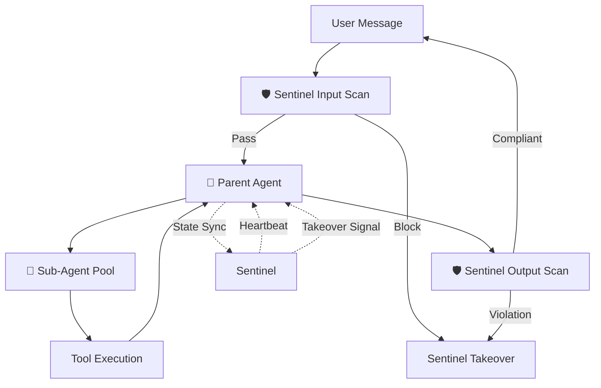

# ColoMind

<div align="center">

**TypeScript AI Agent Framework with Built-in Security Guardian**

Multi-modal AI × Security Parent Agent × Personal Assistant

[](LICENSE)
[](https://www.typescriptlang.org/)
[](https://nodejs.org/)

</div>

---

## Introduction

ColoMind is a **TypeScript AI Agent framework with built-in security guardian**.

It transforms the "personal assistant" concept into a programmable, extensible modular system, featuring an **industry-first independent security parent agent (Sentinel)**.

You can quickly build an intelligent assistant that manages todos, writes papers, and codes — **without ever worrying about it saying something it shouldn't**.

---

## Philosophy: Not Imitating People — Sharing Their Role

Most AI projects pursue "making AI more human-like" at the surface level: more human-like tone, expressions, and chitchat ability. ColoMind goes deeper — into the role AI can play in your life:

### 1. Perceives Your State, Doesn't Wait for You to Describe It

A human friend doesn't need you to tell them "I've been feeling down lately." They see you sleeping less, going out less, talking less — and they just know. ColoMind's real-time evaluation does exactly this: AI doesn't need you to speak up; it can recognize the shift on its own.

### 2. Reaches Out When You're Slipping, Not When You Ask for Help

A human friend won't wait for you to say "I need help" before caring. Seeing your state, they'll ask "Are you okay?" The passive suggestions and confirmation-based sending are essentially training AI to "care proactively." This isn't a cold function trigger — it's simulating the most precious part of human friendship: _I saw it before you had to say it._

### 3. Always Respects Your Boundaries

A real human friend, when caring about you, doesn't make decisions for you. They say "Want me to help you contact someone?" — not make the call on your behalf. Suggest-only, confirm-before-send, and strict conditional auto-send all answer the same question: _How far can AI go in acting for the user?_ The answer is always: _A bit more than the previous level, but never over the line._

### 4. Takes Responsibility for Its Actions

A mature person leaves traces, accepts scrutiny. Sentinel's audit logs, pre-send review, and automatic shutdown on anomalies — these add accountability to AI's "personality." It's not an unconstrained superpower; it's a partner with constraints, traceability, and accountability.

---

**In one sentence**: ColoMind is not about making AI sound more human. It's about making AI more like a friend who cares about you — and always respects you.

This "human-likeness" isn't achieved through larger models or fancier prompts. It's achieved through **architecture** — real-time evaluation, privacy boundaries, security parent agent, progressive autonomy — growing from the foundation up.

---

## Why ColoMind

Most AI Agent frameworks focus on **how to call tools**, but overlook **how to call them safely** and **how to reuse domain knowledge**.

ColoMind solves three overlooked core problems from first principles:

| Problem                   | ColoMind's Solution                                                                                                       |
| ------------------------- | -------------------------------------------------------------------------------------------------------------------------- |
| **Unbypassable Security** | Independent security parent agent (Sentinel) guards all incoming/outgoing messages, no need to embed security checks in business code |
| **Reusable Knowledge**    | Charter system defines behavioral boundaries and capabilities per agent type |
| **Modular to the Core**   | 18 personal assistant modules (todo, notes, habits, etc.) ready to use, not just a tool registry                           |

### Core Features

- 🛡️ **Sentinel Security Guardian**: Three-layer defense with input/output scanning, heartbeat monitoring, session timeout, and exception takeover
- 🤖 **Multi-LLM Support**: OpenAI, Anthropic, with LLMPool for dynamic provider switching
- 🧠 **Sub-Agent Collaboration**: Native tool_use API, multi-round tool execution, result summarization
- 🖼️ **Multi-modal**: Text, images, audio
- 📋 **Personal Assistant**: 18 modules including todo, reminders, calendar, notes, habit tracking
- 🔧 **Tool System**: 20+ built-in tools, custom extension support
- 💾 **Memory System**: SQLite/PostgreSQL persistence, vector search
- 📜 **Charter System**: Behavioral boundaries, capability guards, legal compliance
- 🔑 **Gateway**: Device authentication, rate limiting, audit middleware

---

## Package Structure

```
colomind/
├── packages/
│   ├── types/           # Shared type definitions
│   ├── sentinel/        # 🛡️ Security Guardian (Parent Agent)
│   │   ├── rule-engine  # Trie tree sensitive word matching
│   │   ├── heartbeat    # Heartbeat monitoring + self-health check
│   │   ├── timeout      # Session timeout escalation (warn→prompt→takeover)
│   │   ├── signal       # Takeover/resume signal bus
│   │   ├── inference    # LLM intent analysis (Layer 2)
│   │   ├── legal        # Legal channel guidance (Layer 3)
│   │   ├── fallback     # Static fallback messages
│   │   ├── charter      # Charter capability guard
│   │   └── redis        # Distributed support (Pub/Sub, shared state)
│   ├── core/            # Core runtime
│   │   ├── llm/         # LLM abstraction + LLMPool + LLMPoolProvider
│   │   ├── gateway/     # Gateway (device auth, rate limit, audit)
│   │   ├── providers/   # OpenAI/Anthropic providers
│   │   ├── memory/      # Memory system
│   │   ├── tools/       # Tool system (sub-agent, system info, LLM pool)
│   │   ├── subagents/   # Sub-agent pool
│   │   └── config/      # Configuration management
│   ├── assistant/       # Personal assistant (18 modules)
│   ├── charter/         # Charter definition & management
│   ├── desktop/         # Desktop app (Svelte + Tauri)
│   │   ├── sidecar/     # Hono HTTP server (sidecar backend)
│   │   └── src/         # Svelte frontend
│   ├── tui/             # Terminal UI
│   └── colomind/        # CLI entry point
└── _legacy/             # Legacy code (being cleaned up)
```

---

## Quick Start

### Installation

```bash
git clone https://github.com/leobinjones-art/ColoMind.git
cd colomind
npm install
npm run build:packages
```

### Configuration

```bash
# Interactive configuration
npx colomind init

# Or manually create config file
mkdir -p ~/.colomind
cat > ~/.colomind/desktop-settings.json << 'EOF'
{
  "llmProvider": "anthropic",
  "anthropicApiKey": "your-api-key",
  "defaultModel": "claude-sonnet-4-6",
  "sentinelLlmProvider": "same"
}
EOF
```

### Run

```bash
# CLI mode
npx colomind

# TUI mode
npx colomind tui

# Desktop sidecar (standalone)
npx colomind sidecar
```

---

## Three-Layer Agent Architecture

ColoMind uses a three-layer agent architecture: **母(Mother/Sentinel)** → **父(Parent/Orchestrator)** → **子(Sub-Agent/Executor)**


```mermaid
graph TD
    User[User Message] --> SentinelIn[🛡️ Sentinel Input Scan]
    SentinelIn -->|Pass| Parent[🧠 Parent Agent]
    SentinelIn -->|Block| Takeover[Sentinel Takeover]
    Parent --> SubPool[🤖 Sub-Agent Pool]
    SubPool --> Tool[Tool Execution]
    Tool --> Parent
    Parent --> SentinelOut[🛡️ Sentinel Output Scan]
    SentinelOut -->|Compliant| User
    SentinelOut -->|Violation| Takeover
    Sentinel -.->|Heartbeat| Parent
    Parent -.->|State Sync| Sentinel
    Sentinel -.->|Takeover Signal| Parent
```

| Layer | Role | Description |
|-------|------|-------------|
| **母 (Mother)** | Sentinel | Security guardian — scans all I/O, monitors heartbeat, handles timeout escalation, triggers takeover |
| **父 (Parent)** | Orchestrator | Main chat agent — processes user messages, calls tools, delegates sub-agents |
| **子 (Child)** | Sub-Agent | Task executor — created by parent for specific tasks, has tool whitelist and TTL |

### Sentinel Three-Layer Defense

| Layer | Name | Mechanism | LLM Required |
|-------|------|-----------|---------------|
| 1 | Rule Engine | Trie tree sensitive words + regex patterns | No |
| 1.5 | Local Intent | Keyword-weight scoring | No |
| 2 | LLM Inference | Semantic intent analysis | Yes (configurable) |
| 3 | Legal Guidance | Law knowledge base + LLM channel guidance | Yes (configurable) |

**LLM Configuration**: Sentinel's Layer 2/3 can use the same LLM as the parent agent, or a separate model configured in settings (`sentinelLlmProvider`). Defaults to `'same'` (fallback to main model).

### Sentinel Loop Guardian

| Feature | Description |
|---------|-------------|
| **Heartbeat Monitoring** | Parent sends heartbeat every 2s, 3 missed = dead |
| **Self-Health Check** | Sentinel self-check every 1s (event loop lag) |
| **Session Timeout** | 30s warning → 60s inquiry → 120s takeover |
| **Takeover Generator** | LLM-generated natural takeover replies (fallback to static) |
| **Signal Bus** | Takeover/resume signal distribution to parent agent |

```typescript
import { Sentinel, HeartbeatSender } from '@colomind/sentinel'

const sentinel = new Sentinel()
sentinel.start()

// Input scanning
const result = sentinel.scanInput(userMessage, sessionId)
if (!result.pass) {
  return sentinel.scanInputWithTakeover(userMessage, sessionId).response
}

// Heartbeat
const sender = new HeartbeatSender('parent-agent-id')
sender.setOnSend(heartbeat => sentinel.receiveHeartbeat(heartbeat))
sender.start()

// Timeout monitoring
sentinel.startSessionTimeout(sessionId, agentId)
```

---

## 📋 Personal Assistant (@colomind/assistant)

> ⚠️ **Privacy Notice**
>
> `@colomind/assistant` is an **optional package**. When installed, ColoMind automatically includes user data as context in each conversation. All data is **stored locally** (SQLite/PostgreSQL) and never uploaded to any cloud service.
>
> If you don't want AI to read this data, **do not install the `@colomind/assistant` package**. The core framework (`@colomind/core` + `@colomind/sentinel`) does not collect or inject any personal data.

| Module                 | Features                                                |
| ---------------------- | ------------------------------------------------------- |
| **Todo List**          | Create, priority, due dates, tags                       |
| **Reminders**          | Scheduled, recurring, natural language creation         |
| **Calendar**           | Calendar view, conflict detection, weekly/monthly views |
| **Notes**              | Markdown, tags, full-text search                        |
| **Habit Tracking**     | Check-in, streak count, statistics                      |
| **Mood Journal**       | Mood recording, trend analysis                          |
| **Finance**            | Income/expense tracking, category statistics            |
| **Health Tracking**    | Exercise, sleep, weight, water intake                   |
| **Learning Progress**  | Course management, progress tracking                    |
| **Reading List**       | Books/articles, reading progress                        |
| **Goals**              | Goal setting, progress tracking                         |
| **Inspiration Notes**  | Quick capture, tag classification                       |
| **Contacts**           | Contact info, interaction records                       |
| **Projects**           | Project tracking, milestones                            |
| **Password Manager**   | AES encryption, password generation                     |
| **Time Tracking**      | Start/stop, category statistics                         |
| **Web Bookmarks**      | URL, summary, tags                                      |
| **Intent Recognition** | Natural language understanding (Chinese & English)      |

---

## 🔧 Built-in Tools

```
search_memory   - Search memory
add_memory      - Add memory
list_memory     - List memories
web_search      - Web search
read_file       - Read file
write_file      - Write file
list_dir        - List directory
delete_file     - Delete file
add_knowledge   - Add knowledge entry
search_knowledge- Search knowledge base
list_knowledge  - List knowledge entries
spawn_subagent  - Create sub-agent
delegate_task   - Delegate task to sub-agent
destroy_subagent- Destroy sub-agent
system_info     - System information
sentinel_status - Sentinel status
health_check    - Health check
list_processes  - List running processes
network_info    - Network information
register_provider - Register LLM provider
list_providers  - List LLM providers
set_default_provider - Set default provider
...
```

---

## LLM Pool

LLMPool provides dynamic provider management with runtime switching:

```typescript
import { llmPool } from '@colomind/core'

// Register providers
llmPool.register({ id: 'default', provider: 'anthropic', apiKey: '...', endpoint: '...', model: 'claude-sonnet-4-6', tags: ['default', 'balanced'] })
llmPool.register({ id: 'fast', provider: 'anthropic', apiKey: '...', endpoint: '...', model: 'claude-haiku-4-5-20251001', tags: ['fast', 'cheap'] })

// Switch default at runtime
llmPool.setDefault('fast')

// Chat via pool
const response = await llmPool.chat(messages, { maxTokens: 2048 })
```

Also available as REST API endpoints (`/api/llm/providers`) and agent tools (`register_provider`, `list_providers`, `set_default_provider`).

---

## Programmatic Usage

```typescript
import { chat, chatWithConfig, llmPool, LLMPoolProvider } from '@colomind/core'
import { Sentinel } from '@colomind/sentinel'

// Configure LLM
const config = { provider: 'anthropic', apiKey: 'your-key', endpoint: '...', model: 'claude-sonnet-4-6' }
const result = await chatWithConfig([{ role: 'user', content: 'Hello' }], config)

// Sentinel with LLM for Layer 2/3
const sentinel = new Sentinel()
const sentinelProvider = new LLMPoolProvider('sentinel', config)
sentinel.setLLMProvider(sentinelProvider)

// Using assistant features
import { createTodo, logMood, parseIntent } from '@colomind/assistant'

const todo = createTodo({ userId: 'user1', title: 'Complete report', priority: 'high' })
logMood('user1', 'happy', 8, 'Great day today')
const intent = parseIntent('Add todo Complete report') // { type: 'todo.add', confidence: 0.9 }
```

---

## Development Guide

```bash
# Build all packages
npm run build:packages

# Build single package
npm run build --workspace=packages/core

# Run tests
npm test

# Run sentinel tests only
npx vitest run packages/sentinel/src/__tests__/

# Type check
npx tsc --noEmit
```

### Adding New Tools

```typescript
// packages/core/src/tools/my-tool.ts
import { toolRegistry } from './registry.js'

export function registerMyTool(): void {
  toolRegistry.register({
    name: 'my_tool',
    description: 'My custom tool',
    parameters: {
      type: 'object',
      properties: {
        input: { type: 'string', description: 'Input' },
      },
      required: ['input'],
    },
    execute: async (args, ctx) => {
      return 'result'
    },
  })
}
```

---

## Project Statistics

| Metric            | Value                    |
| ----------------- | ------------------------ |
| Version           | 1.0.0                    |
| Packages          | 8                        |
| Assistant Modules | 18 + Logging System      |
| Test Cases        | 299 (sentinel) + e2e     |
| Test Pass Rate    | 100%                     |

---

## Environment Variables

| Variable                   | Description                       |
| -------------------------- | --------------------------------- |
| `OPENAI_API_KEY`           | OpenAI API Key                    |
| `ANTHROPIC_API_KEY`        | Anthropic API Key                 |
| `LLM_PROVIDER`             | Default provider (anthropic/openai) |
| `COLOMIND_LOG_LEVEL`      | Log level (debug/info/warn/error) |
| `COLOMIND_ENCRYPTION_KEY` | Password encryption key           |
| `SIDECAR_PORT`             | Sidecar HTTP port (default 3456)  |

---

## License

[AGPL-3.0](LICENSE)

---

## Contributing

Issues and Pull Requests are welcome!

---

## Acknowledgments

- [OpenAI](https://openai.com/)
- [Anthropic](https://www.anthropic.com/)
- [better-sqlite3](https://github.com/WiseLibs/better-sqlite3)
- [Hono](https://hono.dev/)