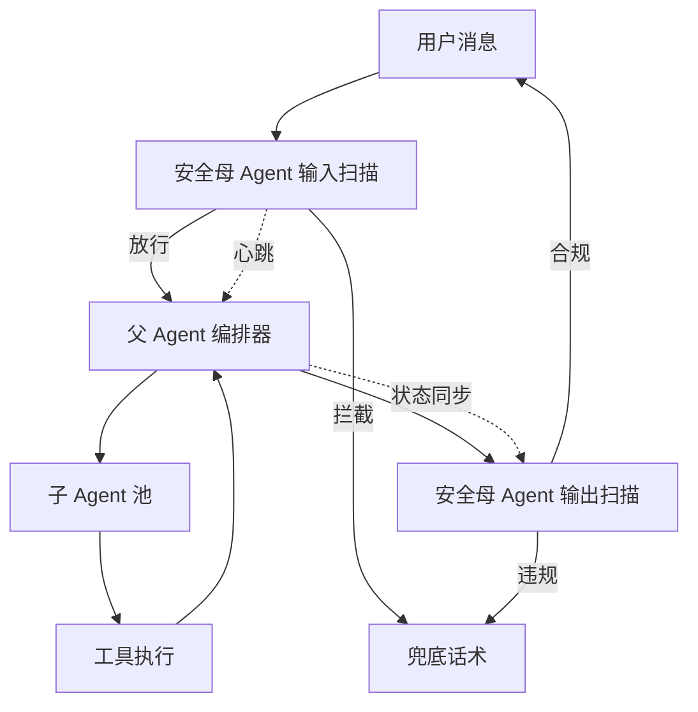

# ColoBot

<div align="center">

**自带安全守护的 TypeScript AI Agent 框架**

多模态 AI × 安全母 Agent × 个人助理

[](LICENSE)
[](https://www.typescriptlang.org/)
[](https://nodejs.org/)

</div>

---

## 简介

ColoBot 是一个**自带安全守护**的 TypeScript AI Agent 框架。

它把"个人助理"做成了可编程、可扩展的模块化系统，并内置了**业界首创的独立安全母 Agent**。

你可以用它快速搭建一个能管待办、写论文、写代码的智能助理，并且**永远不用担心它说出不该说的话**。

---

## 为什么选择 ColoBot

大多数 AI Agent 框架专注于**如何调用工具**，却忽略了**如何安全调用**和**如何复用领域知识**。

ColoBot 从第一性原理出发，解决三个被忽视的核心问题：

| 问题             | ColoBot 的解法                                                        |
| ---------------- | --------------------------------------------------------------------- |
| **安全不可绕过** | 独立的安全母 Agent 守护所有进出消息，无需在业务代码中嵌入安全检查     |
| **知识可复用**   | SOP 将"学术调研""代码重构"等复杂流程封装为可共享的技能模块            |
| **模块化到底**   | 18 个个人助理模块（待办、笔记、习惯等）开箱即用，而非仅提供工具注册表 |

### 核心特点

- 🛡️ **安全守护**: 独立的安全母 Agent，输入输出扫描、进程守护、异常接管
- 🤖 **多 LLM 支持**: OpenAI、Anthropic、MiniMax、自定义 API
- 🧠 **子 Agent 协作**: 任务分解、并行执行、工具白名单
- 🖼️ **多模态**: 文本、图片、音频
- 🐍 **Python WASM**: Pyodide 沙箱执行，无需系统 Python
- 📋 **个人助理**: 待办、提醒、日程、笔记、习惯追踪等 18 个模块
- 🔧 **工具系统**: 内置 20+ 工具，支持自定义扩展
- 💾 **记忆系统**: SQLite/PostgreSQL 持久化，向量搜索

---

## 包结构

```
colobot/
├── packages/
│   ├── types/           # 类型定义
│   ├── sentinel/        # 安全守护母 Agent
│   │   ├── rule-engine/ # 规则引擎（Trie树敏感词）
│   │   ├── heartbeat/   # 心跳协议
│   │   ├── state/       # 状态同步
│   │   ├── signal/      # 接管信号
│   │   └── redis/       # 分布式支持
│   ├── core/            # 核心运行时
│   │   ├── providers/   # LLM Provider
│   │   ├── runtime/     # Agent 运行时
│   │   ├── memory/      # 记忆系统
│   │   ├── tools/       # 工具系统（含 Python WASM）
│   │   ├── subagents/   # 子 Agent
│   │   └── config/      # 配置管理
│   ├── assistant/       # 核心助理
│   │   ├── task/        # 待办、提醒
│   │   ├── schedule/    # 日程
│   │   ├── knowledge/   # 笔记、收藏
│   │   ├── life/        # 习惯、心情、财务、健康
│   │   ├── growth/      # 学习、阅读、目标
│   │   ├── social/      # 人脉
│   │   ├── project/     # 项目
│   │   └── tools/       # 密码、时间追踪
│   ├── tui/             # 终端界面
│   ├── sop-base/        # SOP 流程引擎基类
│   └── sop-academic/    # 学术 SOP
└── _legacy/             # 旧代码（待迁移）
```

---

## 快速开始

### 安装

```bash
# 克隆仓库
git clone https://github.com/your-repo/colobot.git
cd colobot

# 安装依赖
npm install

# 构建
npm run build:packages
```

### 配置

```bash
# 交互式配置
npx colobot init

# 或手动创建配置文件
mkdir -p ~/.colobot
cat > ~/.colobot/config.json << 'EOF'
{
  "model": {
    "provider": "openai",
    "model": "gpt-4o",
    "apiKey": "your-api-key"
  },
  "search": {
    "engine": "duckduckgo",
    "maxResults": 10
  },
  "subAgent": {
    "maxConcurrent": 10,
    "allowedTools": ["read_file", "write_file", "web_search"]
  }
}
EOF
```

### 运行

```bash
# CLI 模式
npx colobot

# TUI 模式
npx colobot tui
```

---

## 功能模块

### 🤖 Agent 核心

| 功能        | 说明                                |
| ----------- | ----------------------------------- |
| 多 Provider | OpenAI / Anthropic / MiniMax / Mock |
| Fallback    | 链式降级，自动切换模型              |
| 流式输出    | 支持 SSE 流式响应                   |
| 上下文压缩  | 超过窗口自动压缩历史                |
| 子 Agent    | 创建、委托、销毁子 Agent            |
| 工具白名单  | 子 Agent 受限权限控制               |

### 🛡️ 安全守护 (@colobot/sentinel)

独立的安全母 Agent，平行链路架构：



| 功能         | 说明                                             |
| ------------ | ------------------------------------------------ |
| **输入扫描** | Trie树敏感词、正则模式、长度/频率限制，<1ms 响应 |
| **输出扫描** | 异步检测，先放行后撤回                           |
| **心跳监控** | 2秒间隔，3次失联判定                             |
| **状态同步** | 父Agent状态实时同步，接管时有完整上下文          |
| **超时处理** | 30s警告 → 60s询问 → 120s接管                     |
| **三层防御** | 规则引擎 → 本地模型 → LLM接管                    |
| **分布式**   | Redis 共享状态、Pub/Sub 信号                     |

```typescript
import { Sentinel } from '@colobot/sentinel'

const sentinel = new Sentinel()
sentinel.start()

// 输入扫描
const result = sentinel.scanInput(userMessage, sessionId)
if (!result.pass) {
  return sentinel.scanInputWithTakeover(userMessage, sessionId).response
}

// 超时监控
sentinel.startSessionTimeout(sessionId, agentId)
```

### 🚀 高并发与扩展

- **子 Agent 池化**：基于信号量的并发控制，上限可配置，默认匹配 CPU 核心数
- **异步非阻塞**：父 Agent 为纯编排器，所有重计算在 Worker Thread 或独立子进程中执行
- **分布式就绪**：通过 Redis Pub/Sub 和共享状态支持多实例部署，安全母 Agent 可独立扩展

### 🐍 Python WASM 沙箱

| 特性            | 说明                              |
| --------------- | --------------------------------- |
| 无需系统 Python | Pyodide 运行在 WebAssembly 中     |
| 跨平台          | macOS/Linux/Windows 统一行为      |
| 安全隔离        | WASM 沙箱天然隔离                 |
| 动态包安装      | 支持 numpy, pandas, matplotlib 等 |

```typescript
// 执行 Python 代码
const result = await toolRegistry.get('python')!.execute({
  code: `
import numpy as np
arr = np.array([1, 2, 3])
print(arr.sum())
  `,
  packages: ['numpy'],
})
```

### 📋 个人助理 (@colobot/assistant)

| 模块         | 功能                         |
| ------------ | ---------------------------- |
| **待办清单** | 创建、优先级、截止日期、标签 |
| **提醒通知** | 定时、重复、自然语言创建     |
| **日程管理** | 日历、冲突检测、周/月视图    |
| **笔记系统** | Markdown、标签、全文搜索     |
| **习惯追踪** | 打卡、连续天数、统计         |
| **情绪日记** | 心情记录、趋势分析           |
| **财务管理** | 收支记录、分类统计           |
| **健康追踪** | 运动、睡眠、体重、饮水       |
| **学习进度** | 课程管理、进度追踪           |
| **阅读清单** | 书籍/文章、阅读进度          |
| **目标管理** | 目标设定、进度追踪           |
| **灵感笔记** | 快速记录、标签分类           |
| **人脉管理** | 联系人、互动记录             |
| **项目管理** | 项目追踪、里程碑             |
| **密码管理** | AES 加密、密码生成           |
| **时间追踪** | 开始/结束、分类统计          |
| **网页收藏** | URL、摘要、标签              |
| **意图识别** | 自然语言理解（中英文支持）  |
| **日志系统** | 统一日志，级别控制，全覆盖  |

### 🔧 内置工具

```
read_file      - 读取文件
write_file     - 写入文件
list_dir       - 列出目录
python         - 执行 Python (WASM 沙箱)
shell          - 执行 Shell 命令
web_search     - 网络搜索
http           - HTTP 请求
add_memory     - 添加记忆
search_memory  - 搜索记忆
spawn_subagent - 创建子 Agent
delegate_task  - 委托任务
...
```

---

## 编程使用

### 基础运行时

```typescript
import { AgentRuntime, OpenAIProvider, SQLiteStore } from '@colobot/core'

const runtime = new AgentRuntime({
  llm: new OpenAIProvider({ apiKey: 'your-key', defaultModel: 'gpt-4o' }),
  memory: new SQLiteStore({ path: '~/.colobot/chat.db' }),
})

const result = await runtime.run({
  agentId: 'my-agent',
  sessionKey: 'session-1',
  userMessage: '你好',
})

console.log(result.response)
```

### Python 执行

```typescript
import { PyodideRuntime } from '@colobot/core/tools'

const runtime = new PyodideRuntime()
const { output, error } = await runtime.runCode(`
import numpy as np
print(np.array([1, 2, 3]).sum())
`)

// 动态安装包
await runtime.installPackage('matplotlib')
```

### 使用助理功能

```typescript
import {
  createTodo,
  createReminderFromText,
  logMood,
  parseIntent,
  setLogLevel,
  createLogger
} from '@colobot/assistant'

// 创建待办
const todo = createTodo({
  userId: 'user1',
  title: '完成报告',
  priority: 'high',
  dueDate: '2024-12-31',
})

// 自然语言创建提醒
const reminder = createReminderFromText('user1', '提醒我明天下午3点开会')

// 记录心情
logMood('user1', 'happy', 8, '今天很顺利')

// 意图识别（支持中英文）
const intent = parseIntent('添加待办 完成报告')
// { type: 'todo.add', confidence: 0.9 }

// 日志系统
setLogLevel('debug')  // debug/info/warn/error
const logger = createLogger('MyModule')
logger.info('操作完成', { userId: 'user1', action: 'create' })
// [2026-05-01T08:54:09.780Z] [INFO] [MyModule] 操作完成 {"userId":"user1","action":"create"}
```

---

## SOP 开源生态

ColoBot 支持可插拔的 SOP (Standard Operating Procedure) 流程模块，用于封装复杂的多步骤任务。

### 架构

```
@colobot/sop-base          # 流程引擎基类（官方）
@colobot/sop-academic      # 学术研究流程（官方示例）
colobot-sop-*              # 社区贡献（npm 发布）
```

### 官方 SOP 模块

| 模块                    | 场景               | 状态      |
| ----------------------- | ------------------ | --------- |
| `@colobot/sop-base`     | 流程引擎基类       | ✅ 已实现 |
| `@colobot/sop-academic` | 论文写作、文献调研 | ✅ 已实现 |
| `@colobot/sop-writing`  | 长文写作、报告生成 | 📋 规划中 |
| `@colobot/sop-coding`   | 项目开发、代码重构 | 📋 规划中 |

### @colobot/sop-base 核心概念

#### 类型定义

```typescript
// 任务状态
type SopTaskStatus =
  | 'created'
  | 'analyzing'
  | 'ready'
  | 'running'
  | 'paused'
  | 'completed'
  | 'failed'
  | 'cancelled'

// 步骤定义
interface SopStep {
  id: string
  name: string
  description: string
  status: 'pending' | 'in_progress' | 'completed' | 'failed' | 'skipped'
  dependencies?: string[] // 依赖的步骤 ID
  data?: Record<string, unknown>
}

// 任务定义
interface SopTask {
  id: string
  type: string
  description: string
  status: SopTaskStatus
  steps: SopStep[]
  currentStepIndex: number
  context: Record<string, unknown>
  output?: string
}
```

#### SopEngine 基类

```typescript
import { SopEngine } from '@colobot/sop-base'

class MySopEngine extends SopEngine {
  // 必须实现：分析用户请求，返回步骤列表
  async analyzeTask(userMessage: string, context?: Record<string, unknown>): Promise<TaskAnalysis> {
    return {
      type: 'my-task',
      description: '任务描述',
      steps: [
        { name: 'step-1', description: '第一步' },
        { name: 'step-2', description: '第二步', dependencies: ['step-1'] },
      ],
    }
  }
}

// 使用
const engine = new MySopEngine({ name: 'my-sop', version: '1.0.0' })
const task = await engine.createTask('用户请求')
await engine.startTask(task.id)
```

#### 核心方法

| 方法                                   | 说明         |
| -------------------------------------- | ------------ |
| `createTask(message, context)`         | 创建任务     |
| `startTask(taskId)`                    | 启动任务     |
| `pauseTask(taskId)`                    | 暂停任务     |
| `resumeTask(taskId)`                   | 恢复任务     |
| `cancelTask(taskId)`                   | 取消任务     |
| `getCurrentStep(taskId)`               | 获取当前步骤 |
| `advanceStep(taskId)`                  | 推进到下一步 |
| `submitStepData(taskId, stepId, data)` | 提交步骤数据 |
| `generateOutput(taskId)`               | 生成最终输出 |

#### 事件系统

```typescript
const engine = new MySopEngine(
  { name: 'my-sop', version: '1.0.0' },
  {
    onTaskCreated: (task) => console.log('任务创建:', task.id),
    onStepStarted: (task, step) => console.log('步骤开始:', step.name),
    onStepCompleted: (task, step) => console.log('步骤完成:', step.name),
    onTaskCompleted: (task) => console.log('任务完成:', task.output),
  },
)
```

### 开发一个 SOP 包

#### 1. 创建包结构

```
colobot-sop-my-domain/
├── package.json
├── tsconfig.json
└── src/
    ├── index.ts          # 导出引擎
    ├── engine.ts         # 引擎实现
    ├── prompts.ts        # Prompt 模板（可选）
    └── __tests__/
        └── index.test.ts
```

#### 2. package.json

```json
{
  "name": "@your-org/sop-my-domain",
  "version": "1.0.0",
  "type": "module",
  "main": "dist/index.js",
  "types": "dist/index.d.ts",
  "dependencies": {
    "@colobot/sop-base": "^0.1.0",
    "@colobot/core": "^0.3.0"
  }
}
```

#### 3. 实现引擎

```typescript
// src/engine.ts
import { SopEngine, type TaskAnalysis } from '@colobot/sop-base'

export class MyDomainSopEngine extends SopEngine {
  constructor() {
    super({ name: 'my-domain', version: '1.0.0' })
  }

  async analyzeTask(userMessage: string, context?: Record<string, unknown>): Promise<TaskAnalysis> {
    // 1. 分析用户意图
    const intent = await this.detectIntent(userMessage)

    // 2. 生成步骤列表
    return {
      type: intent.type,
      description: userMessage,
      steps: [
        { name: 'analyze', description: '分析需求' },
        { name: 'collect', description: '收集信息', dependencies: ['analyze'] },
        { name: 'generate', description: '生成结果', dependencies: ['collect'] },
      ],
      requiredTools: ['web_search', 'read_file', 'write_file'],
      estimatedTime: 10,
      complexity: 5,
    }
  }

  private async detectIntent(message: string): Promise<{ type: string }> {
    // 实现意图检测逻辑
    return { type: 'my-domain-task' }
  }
}
```

#### 4. 导出

```typescript
// src/index.ts
export { MyDomainSopEngine } from './engine.js'
```

#### 5. 注册步骤执行器（可选）

```typescript
// 自定义步骤执行逻辑
engine.registerStepExecutor('analyze', async (step, task, context) => {
  // 执行分析逻辑
  const result = await doAnalysis(task.context)
  return { analysisResult: result }
})

engine.registerStepExecutor('collect', async (step, task, context) => {
  // 基于上一步结果收集信息
  const analysis = task.steps.find((s) => s.id === 'analyze')?.data?.analysisResult
  const info = await collectInfo(analysis)
  return { collectedInfo: info }
})
```

### Prompt 模板

sop-base 提供了内置的 Prompt 模板：

```typescript
import {
  TASK_ANALYSIS_PROMPT,
  STEP_EXECUTION_PROMPT,
  OUTPUT_GENERATION_PROMPT,
  buildPrompt,
} from '@colobot/sop-base'

// 使用模板
const prompt = buildPrompt(TASK_ANALYSIS_PROMPT, {
  userMessage: '帮我写一篇论文',
  context: JSON.stringify({ field: 'AI' }),
  maxSteps: 10,
})
```

### 发布到 npm

```bash
# 构建
npm run build

# 发布
npm publish --access public
```

### 使用社区 SOP

```bash
npm install @community/sop-xxx
```

```typescript
import { XxxSopEngine } from '@community/sop-xxx'

const engine = new XxxSopEngine()
const task = await engine.createTask('用户请求')
await engine.startTask(task.id)
```

---

## 开发指南

### 开发命令

```bash
# 构建所有包
npm run build:packages

# 构建单个包
npm run build --workspace=packages/core

# 测试
npm test

# 类型检查
npx tsc --noEmit
```

### 添加新工具

```typescript
// packages/core/src/tools/my-tool.ts
import { toolRegistry } from './registry.js'

export function registerMyTool(): void {
  toolRegistry.register({
    name: 'my_tool',
    description: 'My custom tool',
    parameters: {
      type: 'object',
      properties: {
        input: { type: 'string', description: 'Input' },
      },
      required: ['input'],
    },
    execute: async (args, ctx) => {
      return 'result'
    },
  })
}
```

---

## 项目统计

| 指标       | 数值                  |
| ---------- | --------------------- |
| 版本       | 0.3.1                 |
| 总代码量   | ~28,500 行 TypeScript |
| 源文件数   | 146 个                |
| 包数量     | 7 个                  |
| 助理模块   | 18 个 + 日志系统      |
| 测试用例   | 522 个                |
| 测试覆盖率 | 56%+                  |

---

## 环境变量

| 变量                     | 说明                             |
| ------------------------ | -------------------------------- |
| `OPENAI_API_KEY`         | OpenAI API Key                   |
| `ANTHROPIC_API_KEY`      | Anthropic API Key                |
| `MINIMAX_API_KEY`        | MiniMax API Key                  |
| `COLOBOT_LOG_LEVEL`      | 日志级别 (debug/info/warn/error) |
| `COLOBOT_LOG_CONSOLE`    | 是否输出到控制台 (true/false)    |
| `COLOBOT_ENCRYPTION_KEY` | 密码加密密钥                     |

---

## 许可证

[AGPL-3.0](LICENSE)

---

## 贡献

欢迎提交 Issue 和 Pull Request。

---

## 致谢

- [OpenAI](https://openai.com/)
- [Anthropic](https://www.anthropic.com/)
- [Pyodide](https://pyodide.org/)
- [better-sqlite3](https://github.com/WiseLibs/better-sqlite3)
- [llm-guard](https://github.com/protectai/llm-guard)
- [Tesseract.js](https://github.com/naptha/tesseract.js)
- [@xenova/transformers](https://github.com/xenova/transformers.js)
