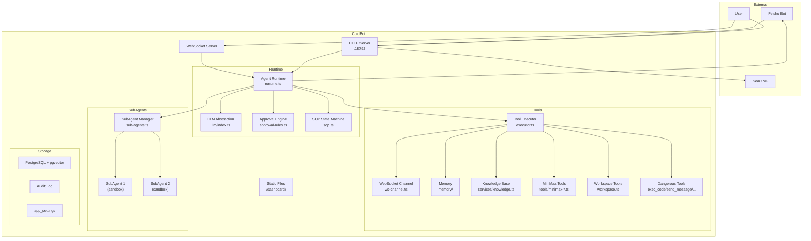
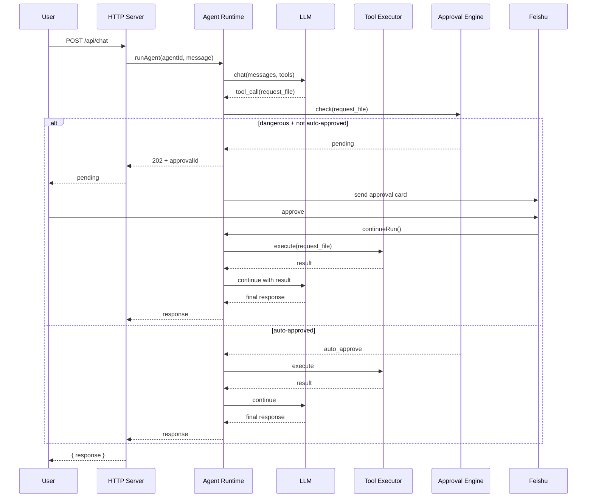
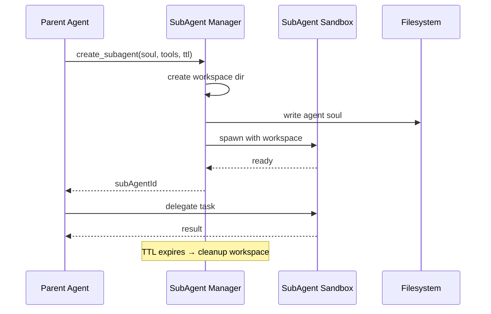

# Architecture

## System Overview

ColoBot is a single-agent + sub-agent collaboration platform. A single parent Agent handles user requests with full tool access, while sub-agents run in isolated sandboxes for delegated tasks.



---

## Module Responsibilities

### Entry Point

**`src/colobot-server.ts`**

HTTP + WebSocket server. All routing lives here (no external router). Responsibilities:
- Parse body, CORS headers, client IP extraction
- Route to appropriate handler (agents, chat, settings, etc.)
- WebSocket connection management and message routing
- Rate limiting enforcement
- Authentication middleware

### Agent Runtime

**`src/agent-runtime/runtime.ts`**

Core agent loop. Receives a user message, checks SOP state, runs the LLM with full tool access, and returns the response.

- `runAgent()` — single-shot agent execution
- `runAgentStream()` — streaming response via WebSocket

**`src/agent-runtime/approval.ts`**

Pending approval queue. Tracks dangerous tool calls waiting for user approval. Notifies via Feishu card and WebSocket push.

**`src/agent-runtime/approval-rules.ts`**

Four-layer approval funnel:

1. **Tirith Rules** — keyword/regex exact match, sorted by priority
2. **Pattern History** — 7-day frequency of same tool for same agent
3. **User Evolution** — per-user approve/reject count thresholds
4. **Smart LLM** — fallback裁决 when rules can't decide

Rules are stored in `approval_rules` DB table and seed on first run.

**`src/agent-runtime/sop.ts`**

Academic SOP state machine. Manages thesis/literature_review/experiment_report workflows. State stored in `agent_memory` with key `sop_state:{sessionKey}`.

### LLM Layer

**`src/llm/index.ts`**

Provider-agnostic LLM interface. Supports:
- OpenAI (`openai:gpt-4o`, `openai:gpt-4o-mini`)
- Anthropic (`anthropic:claude-sonnet-4-20250514`)
- MiniMax (`minimax:MiniMax-Text-01`)

Fallback chain: tries primary, then each fallback in order until success. Automatic retry with exponential backoff.

### Tool System

**`src/agent-runtime/tools/executor.ts`**

Tool registry. `registerTool(name, fn)` registers a tool. Each tool can specify:
- `require_approval`: marks as dangerous
- `rbac`: required role (`admin`, `developer`, `readonly`)
- `check_fn`: custom permission function

**Dangerous Tools** (require approval):
- `exec_code` — sandboxed Node.js code execution
- `send_message` — multi-channel notifications
- `delete_agent` — delete an agent
- `update_agent` — modify agent config
- `delete_file` — delete files

**Workspace Tools** (`workspace.ts`):
- `read_file`, `write_file`, `list_dir`, `delete_file`
- Sub-agents are sandboxed to their own workspace directory
- Parent agent has unrestricted access

**MiniMax Tools**:
- Text generation (`minimax-text`)
- Image generation (`minimax-image`)
- TTS (`minimax-tts`)
- Video generation (`minimax-video`)
- Music generation (`minimax-music`)
- Voice synthesis (`minimax-voice`)
- Web search (`minimax-search`)
- File operations (`minimax-file`)

**`src/agent-runtime/tools/knowledge.ts`**

Agent-direct knowledge operations: `add_knowledge`, `search_knowledge`, `list_knowledge`.

### Memory

**`src/memory/vector.ts`**

Vector similarity search using pgvector `cosine_distance`. Stores agent conversation memories with embeddings.

**`src/memory/db.ts`**

Database client using `pg`. All queries go through this module.

### Sub-Agents

**`src/agent-runtime/sub-agents.ts`**

Manages sub-agent lifecycle:
- Creates isolated workspace directory
- Assigns tool whitelist/blacklist
- Sets TTL (auto-cleanup via `SetInterval`)
- Parent agent can spawn sub-agents via `create_subagent` tool

### Skills & Triggers

**`src/agent-runtime/skill-runtime.ts`**

Markdown-based skill executor. Skills are defined in Markdown with trigger words, descriptions, and a tool execution sequence. Triggered by keyword match in user message.

**`src/agent-runtime/skill-evolution.ts`**

Skill evolution workflow: Agent proposes skill improvement → approval → apply. Workflow:
1. Agent generates skill modification proposal
2. Stored in `skill_proposals` table
3. Human reviews and approves/rejects via `/api/approvals`
4. On approval, skill is updated

**`src/agent-runtime/trigger-runtime.ts`**

Trigger engine supporting:
- **Cron** — `*/5 * * * *` style scheduling
- **Interval** — every N minutes
- **Webhook** — HTTP callback trigger
- **Condition** — evaluates context before firing

Trigger state (`next_fire_at`) is persisted to DB. On restart, missed triggers are compensated.

### Channels

**`src/services/feishu.ts`**

Feishu bot integration:
- Interactive cards with approve/reject buttons
- `tenant_access_token` management (auto-refresh)
- Feishu notification sending

**`src/channels/ws-channel.ts`**

WebSocket push channel for real-time streaming responses to connected clients.

### Settings

**`src/services/settings-cache.ts`**

DB-backed settings with in-memory cache. Settings stored in `app_settings` table:
- LLM API keys and model configs
- Feishu credentials
- Notification preferences
- SubAgent defaults

**`src/services/settings.ts`**

Typed settings accessors. Used by Dashboard and runtime.

---

## Data Flow

### Chat Flow



### Sub-Agent Flow



---

## Database Schema

### Core Tables

| Table | Purpose |
|-------|---------|
| `agents` | Agent definitions (name, soul, model config) |
| `agent_memory` | Per-session memory (SOP state, conversation history) |
| `skills` | Skill registry (markdown content, trigger words) |
| `skill_proposals` | Pending skill evolution proposals |
| `approval_rules` | Tirith rule definitions with priority |
| `approval_requests` | Active pending approvals |
| `knowledge` | Knowledge base entries (concept/template/rule) |
| `knowledge_vectors` | pgvector embeddings for knowledge |
| `app_settings` | Key-value app configuration |
| `audit_log` | All significant actions |
| `trigger_definitions` | Cron/webhook/condition trigger configs |

---

## Security Model

### Authentication

API Key via `Authorization: Bearer <key>` header. Keys configured via CLI or env. No key configured = dev mode (no auth required).

### Rate Limiting

Sliding window per IP + endpoint. Returns `429` with `Retry-After` header when exceeded.

### Tool Permissions

Tool executor checks:
1. RBAC role (`admin`, `developer`, `readonly`) via `tool.rbac`
2. Custom `check_fn` function
3. Sub-agent tool whitelist/blacklist
4. `require_approval` flag for dangerous tools

### SSRF Protection

`safeFetch()` double-resolves DNS and blocks private IP ranges. All outbound HTTP goes through this wrapper.

### Sub-Agent Isolation

Each sub-agent gets an isolated filesystem directory. Cannot escape via path traversal (`sandboxPath()` check).

---

## Content Policy

`src/content-policy/` intercepts user messages for academic workflows:

- **Thesis SOP** (7 steps): 收集主题 → 补充资料 → 任务拆解 → 操作手册 → 实验指引 → 数据分析 → 论文草稿
- **Literature Review SOP** (5 steps): 确定领域 → 检索策略 → 筛选整理 → 分析评述 → 综述大纲
- **Experiment Report SOP** (6 steps): 实验目的 → 材料方法 → 实验步骤 → 数据记录 → 数据分析 → 报告草稿

Triggered by keywords: 论文, 文献综述, 实验报告, literature review, research paper, etc.

---

## Context Compression

When conversation history exceeds 80% of context window, `compression.ts` triggers:
1. LLM summarizes old messages
2. Keeps last 6 messages intact
3. Stores compressed summary in `agent_memory`

---

## Dashboard Tabs

```
飞书配置 | 模型设置 | Skill 仓库 | 审批管理 | 审计日志 | SubAgent
```

Single-file HTML dashboard (`src/dashboard/index.html`), no external dependencies.
